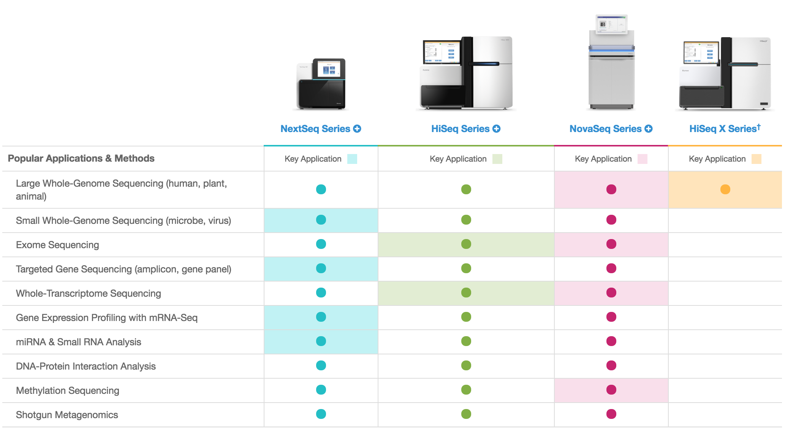
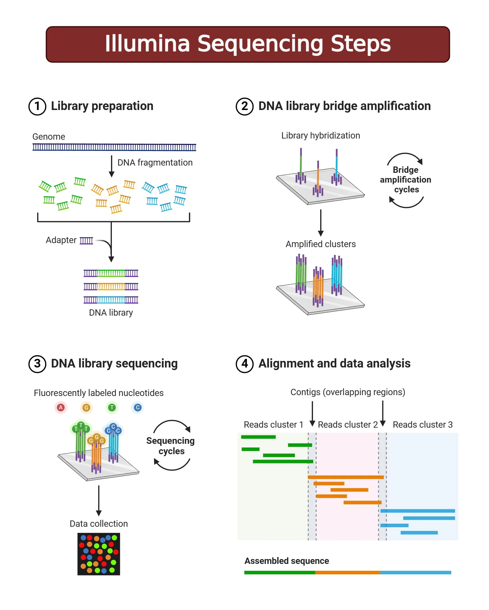
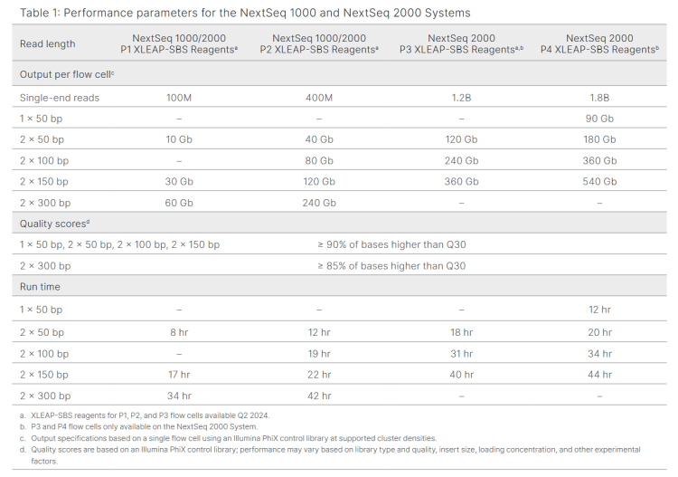
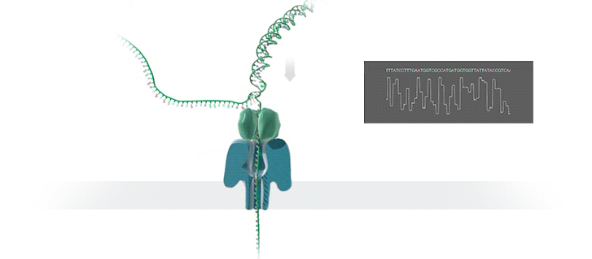
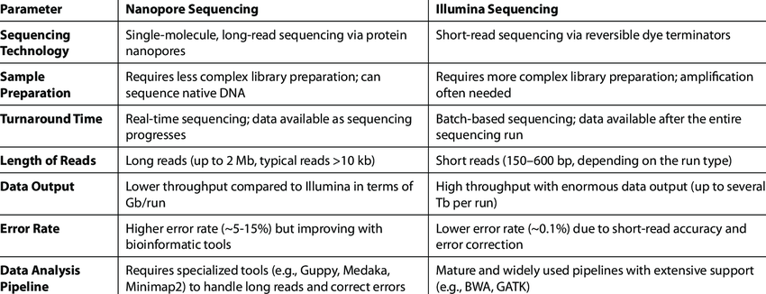
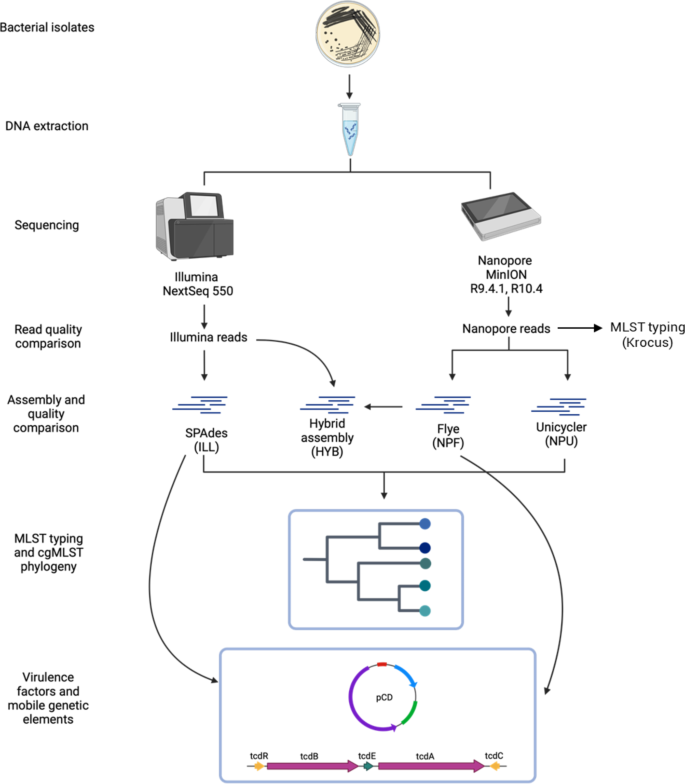

# Introduction to Next Generation Sequencing

!!! info "Lesson overview"
    **Teaching:** 15 min  
    **Exercises:** 15 min  

    **Questions**

    - How do you plan a metagenomics experiment?
    - How does a metagenomics project look like?

    **Objectives**

    - Learn the differences between shotgun and metabarcoding (amplicon metagenomics) techniques.
    - Understand the importance of metadata.
    - Familiarize yourself with the Cuatro Ciénegas experiment.

## Introduction to Next-Generation Sequencing

Next‑Generation Sequencing (NGS) describes high‑throughput technologies that perform massively parallel sequencing, producing millions to billions of short reads per run. Compared with Sanger sequencing, NGS dramatically reduced cost and time per base, enabling population-scale, clinical, and environmental genomics.
Sequencing (determining of DNA/RNA nucleotide sequence) is used all over the world for all kinds of analysis. The product of these sequencers are reads, which are sequences of detected nucleotides. Depending on the technique these have specific lengths (30-500bp) or using Oxford Nanopore Technologies sequencing have much longer variable lengths.

Key concepts:
- Sequencing libraries: DNA or cDNA is fragmented and adapters are ligated so fragments can be amplified and read by the sequencer.
- Read: A single sequence produced by the instrument (commonly 50–300 bp for short‑read platforms).
- Paired‑end reads: Both ends of a DNA fragment are sequenced, improving mapping, assembly, and detection of insertions/deletions.
- Coverage (depth): Average count of reads covering each base; higher coverage increases confidence for variant calling and assemblies.
- Quality scores: Per‑base confidence values (Phred scale) recorded in `FASTQ` files.

Typical NGS workflow steps: library preparation, cluster or bead generation, sequencing reactions, base calling, demultiplexing (if multiplexed), and downstream QC and analysis.

# Illumina Sequencing (Sequencing‑by‑Synthesis)

Most of the information described are based on  a presnetation from [Microbe Notes](https://microbenotes.com/illumina-sequencing/).

Illumina sequencing is one of the most widely used next-generation sequencing (NGS) technology that uses sequencing by synthesis to detect individual DNA bases as they are added to a growing strand.

How it works (brief):
- Library preparation: DNA is fragmented and adapters (including sample indices) are ligated.
- Cluster generation: Fragments bind to complementary oligonucleotides on the flow cell and are amplified by bridge amplification, forming clusters of identical copies.
- Sequencing‑by‑synthesis: Fluorescent reversible terminator nucleotides are incorporated one base per cycle; after each incorporation the flow cell is imaged to record the signal from each cluster.
- Paired‑end sequencing: After completing the first read, chemistry is used to enable sequencing of the fragment's opposite end.
- Base calling and QC: Images are processed to call bases and assign Phred quality scores; data are output as demultiplexed `FASTQ` files when samples were multiplexed.

Strengths and limitations:
- Strengths: Very high throughput, low per‑base cost, robust ecosystem of library kits and analysis tools, and high accuracy for short reads.
- Limitations: Short reads make resolving large repeats and complex structural variants harder; some systematic errors (substitutions) increase toward read ends; library prep biases can skew representation.

## Principle of Illumina Sequencing

Illumina sequencing works on the principle of sequencing by synthesis (SBS). This involves identifying DNA bases as they are added to a growing DNA strand. Fluorescently-labeled reversible terminator nucleotides are used and the fluorescence emitted from each added nucleotide is captured. Each of the four DNA bases is labelled with a unique fluorescent dye, allowing the sequencing system to detect which nucleotide has been added during each cycle. The system captures images of these signals which are then used to determine the exact sequence of the DNA fragment. 

Illumina sequencing also uses bridge amplification. In this process, DNA molecules with ligated adapters are used as templates for repeated amplification on a solid surface like a glass slide. The slide is coated with oligonucleotides complementary to the adapters, which allows the DNA to form clusters of each fragment. This amplification process creates millions of these clusters on the slide. The clusters enhance the signal and make it easier to detect and differentiate between DNA bases by color. 

During sequencing, nucleotides with a unique fluorescent label are added, incorporated, and detected in real time. These nucleotides also act as temporary terminators of DNA synthesis, ensuring that only one base is added at a time which reduces errors and provides high accuracy in reading the sequence. Once imaged, the terminator is cleaved and the next base is added. This cycle is repeated until the entire DNA fragment has been sequenced.

## Steps/Process of Illumina Sequencing

### 0. Nucleic Acid Extraction

The first step in Illumina sequencing is isolating the genetic material from samples of interest. The extraction process is important because the quality of the nucleic acids extracted will directly affect the sequencing results. After extraction, a quality control check is usually performed to ensure the nucleic acids are pure and accurately quantified. UV spectrophotometry is typically used to check the purity, while fluorometric methods are preferred for measuring nucleic acid concentration.

### 1. Library Preparation

After nucleic acids are isolated, they are prepared for sequencing by creating a library which is a collection of adapter-ligated DNA fragments that can be read by the sequencer. The process starts with DNA fragmentation, where the sample is broken into smaller fragments using methods like mechanical shearing, enzymatic digestion, or transposon-based fragmentation. These fragments undergo end repair and A-tailing to prepare for the attachment of short specific DNA sequences called adapters to both ends of the fragments. These adapters contain sequences that help bind the DNA to the sequencing flow cell. They also include barcode sequences that allow multiple samples to be sequenced simultaneously and distinguished later in the analysis.

The choose of the kit is really important, NextSeq 2000

Now that we have the DNA library ready, we start using the **sequencing machine**. 

### 2. DNA Library bridge amplification ( Cluster Generation by Bridge Amplification)

The DNA library is loaded onto a flow cell containing small lanes where amplification and sequencing occurs. The DNA fragments bind to complementary primers attached to the solid surface of the flow cell and undergo bridge amplification. In bridge PCR, each DNA strand bends over to form a bridge on a chip. Forward and reverse primers on the chip help the DNA form these bridges. Each bridge is amplified, creating many clusters at each spot. The process of cluster generation finishes when each DNA spot on the chip has enough copies to produce a strong, clear signal. 

### 3. DNA Library Sequencing ( Sequencing by Synthesis (SBS) )

The DNA library is loaded onto a flow cell containing small lanes where amplification and sequencing occurs. The DNA fragments bind to complementary primers attached to the solid surface of the flow cell and undergo bridge amplification. In bridge PCR, each DNA strand bends over to form a bridge on a chip. Forward and reverse primers on the chip help the DNA form these bridges. Each bridge is amplified, creating many clusters at each spot. The process of cluster generation finishes when each DNA spot on the chip has enough copies to produce a strong, clear signal. 

###  4. Data Analysis

Once the sequencing is completed, the sequences obtained are processed and analyzed using bioinformatics tools.
Don't worry, we will go through some during this workshop !

### Strength and limitations of Illumina Sequencing 

### Strengths and Limitations of Illumina Sequencing

**Strengths:**

- **High accuracy**: Raw base quality >99% (Q30), providing highly reliable sequence data
- **Cost-effective**: Lowest cost per gigabase among sequencing technologies, ideal for large-scale projects
- **High throughput**: Can generate hundreds of gigabases to terabases of data per run depending on the platform
- **Well-established protocols**: Extensive library preparation kits and validated workflows available
- **Mature bioinformatics tools**: Large ecosystem of analysis software and pipelines specifically designed for short-read data
- **Reproducibility**: Highly consistent results between runs and across different laboratories
- **Versatile applications**: Suitable for RNA-seq, ChIP-seq, variant calling, metagenomics, and many other applications
- **Multiplexing capability**: Can sequence many samples simultaneously using barcoding strategies

**Limitations:**

- **Short read length**: Typically 150-300 bp, limiting ability to resolve complex genomic regions
- **Repetitive regions**: Difficulty assembling or mapping reads in repetitive sequences longer than the read length
- **Structural variants**: Poor detection of large insertions, deletions, inversions, and complex rearrangements
- **GC bias**: Amplification during library preparation can introduce bias in GC-rich or GC-poor regions
- **PCR duplicates**: Amplification steps create duplicate reads that must be identified and removed
- **De novo assembly limitations**: Short reads produce fragmented assemblies with many contigs/scaffolds
- **Long preparation time**: Library preparation and sequencing runs can take several days to complete

## Other Sequencing Technology: Nanopore Sequencing 

All Oxford Nanopore sequencing devices use flow cells which contain an array of tiny holes — nanopores — embedded in an electro-resistant membrane. Each nanopore corresponds to its own electrode connected to a channel and sensor chip, which measures the electric current that flows through the nanopore. When a molecule passes through a nanopore, the current is disrupted to produce a characteristic ‘squiggle’. The squiggle is then decoded using basecalling algorithms to determine the DNA or RNA sequence in real time.

You can think of the current as water flowing through a pipe. When an object enters the pipe, the flow of water is disrupted, just as DNA disrupts the current as it passes through the nanopore. Each nucleotide (A,T,C,G) creates a different current disrupting, that can be decoded using basecalling algorithms to determine the DNA or RNA sequence in real time.

### Strength and limitations of Nanopore Sequencing 

**Strengths:**

- **Ultra-long reads**: Can generate reads exceeding 100 kb, with some reaching over 2 Mb in length, enabling better resolution of complex genomic regions
- **Real-time sequencing**: Data analysis can begin immediately as sequencing progresses, allowing for rapid decision-making and adaptive sampling
- **Direct RNA sequencing**: Can sequence native RNA molecules without reverse transcription, preserving modification information
- **Portability**: Devices like the MinION are handheld and USB-powered, enabling fieldwork and point-of-care applications
- **No amplification bias**: Can sequence native DNA directly without PCR amplification, avoiding GC-content bias
- **Rapid library preparation**: Sample-to-sequence time can be as short as 10 minutes
- **Scalable throughput**: Platform options range from portable MinION to high-throughput PromethION
- **Multiplexing capability**: Can sequence many samples simultaneously using barcoding strategies

**Limitations:**

- **Higher error rate**: Raw accuracy typically ranges from 92-98%, lower than Illumina's >99% accuracy (though improving with newer chemistry and algorithms)
- **Homopolymer errors**: Struggles with accurately determining the length of repeated nucleotides (e.g., AAAAA)
- **Higher cost per base**: More expensive per gigabase compared to short-read sequencing
- **Pore degradation**: Nanopores can degrade over time during sequencing runs, reducing throughput
- **Computational requirements**: Basecalling, especially high-accuracy modes, requires significant computational resources
- **Throughput variability**: Output can vary between flow cells and depends on DNA quality and library preparation

## Comparison and Summary

Here is a **Comparison between Nanopore Sequencing and Illumina Sequencing** :

## Combination of Short and Long read Sequencing : Hybrid Assembly

Short reads and long reads have different strengths and limitations, which make them complementary. By combining both technologies in a hybrid assembly approach, researchers can leverage the advantages of each:

- **Long reads** (Nanopore/PacBio) provide the scaffolding and resolve complex structural regions, repetitive elements, and large-scale genomic features
- **Short reads** (Illumina) polish the assembly and correct errors, providing high-accuracy base calls

This hybrid strategy is particularly valuable for de novo genome assembly, structural variant detection, and resolving complex genomic regions where either technology alone would be insufficient. We will see later applications in the workshop.

## Further Reading

- [Illumina technology overview](https://www.illumina.com/content/dam/illumina-marketing/documents/products/illumina_sequencing_introduction.pdf)

