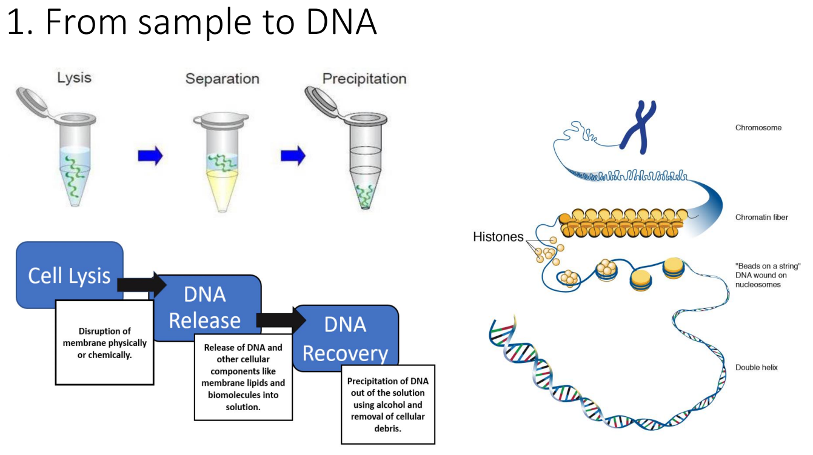
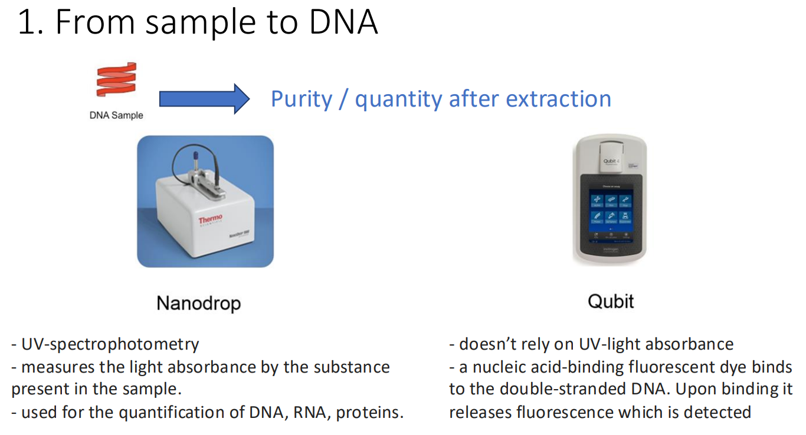
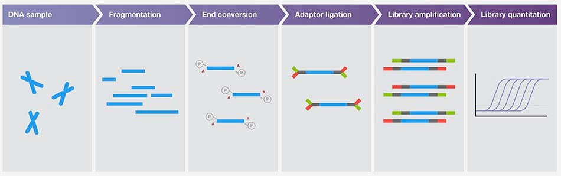
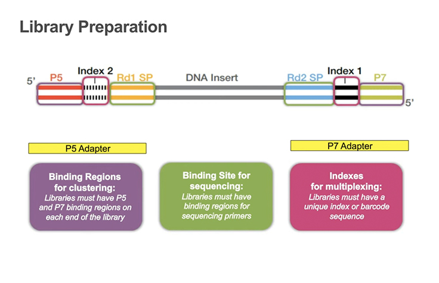
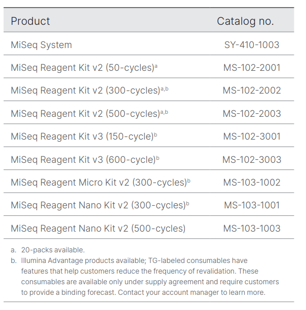
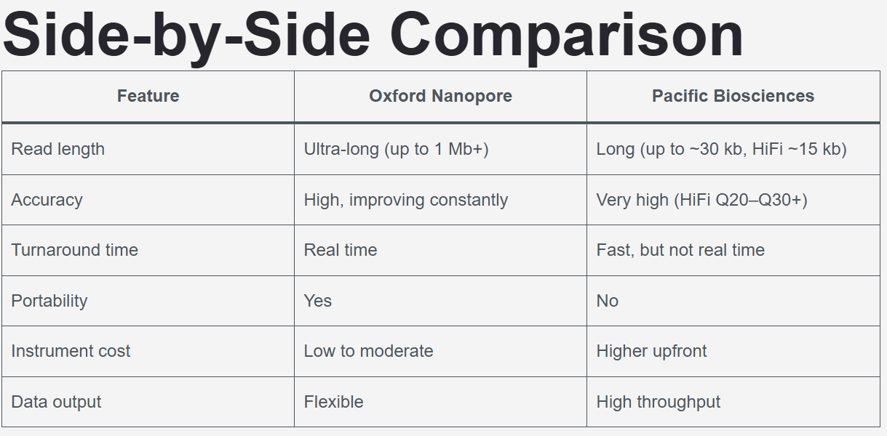

# Introduction to Next Generation Sequencing

!!! info "Lesson overview"
    **Questions**

    - What is Next-Generation Sequencing (NGS)?
    - How does Illumina sequencing work?
    - What are the differences between short-read and long-read sequencing technologies?
    - When should you use Illumina vs Nanopore sequencing?

    **Objectives**

    - Understand the principles of Next-Generation Sequencing.
    - Learn how Illumina sequencing-by-synthesis works.
    - Understand the process of Nanopore sequencing.
    - Compare the strengths and limitations of Illumina and Nanopore technologies.
    - Learn about hybrid assembly approaches combining short and long reads.


## Data Used 

In this training we will build an assembly of a bacterial genome, from data produced in this paper: 
[Hikichi, M., M. Nagao, K. Murase, C. Aikawa, T. Nozawa et al., 2019 Complete Genome Sequences of Eight Methicillin-Resistant Staphylococcus aureus Strains Isolated from Patients in Japan](https://journals.asm.org/doi/10.1128/mra.01212-19)

Methicillin-resistant Staphylococcus aureus (MRSA) is a major pathogen causing nosocomial infections, and the clinical manifestations of MRSA range from asymptomatic colonization of the nasal mucosa to soft tissue infection to fulminant invasive disease. Here, we will analyze one of the eight MRSA strains isolated from patients in Japan : sample **KUN1163**.


## Introduction to Next-Generation Sequencing

Next‑Generation Sequencing (NGS) describes high‑throughput technologies that perform massively parallel sequencing, producing millions to billions of short reads per run. It is not the sames uses as  **Sanger sequencing**. NGS dramatically reduced cost and time per base, enabling population-scale, clinical, and environmental genomics.
Sequencing (determining of DNA/RNA nucleotide sequence) is used all over the world for all kinds of analysis. The product of these sequencers are reads, which are sequences of detected nucleotides. Depending on the technique these have specific lengths (30-500bp) or using Oxford Nanopore Technologies sequencing have much longer variable lengths.

## Comparison: Sanger vs Next-Generation Sequencing (NGS)

| Feature | Sanger Sequencing | NGS (Illumina) | NGS (Nanopore) |
|---------|-------------------|----------------|----------------|
| **Read length** | 800-1000 bp | 150-300 bp | 10 kb - >2 Mb |
| **Throughput** | 1 sequence per reaction | Millions to billions of reads | Thousands to millions of reads |
| **Accuracy** | ~99.9% | >99% (Q30+) | 92-98% (improving) |
| **Run time** | 1-3 hours | Hours to days | Minutes to days (real-time) |
| **Cost per base** | High (~$500-2400/Mb) | Very low (~$0.01-0.10/Mb) | Moderate (~$0.10-1/Mb) |
| **Best for** | Targeted sequencing, validation, single genes | Whole genomes, transcriptomes, variants, metagenomics | De novo assembly, structural variants, long repeats |
| **Sample type** | Pure DNA, PCR products, plasmids | Any DNA/RNA (requires library prep) | Native DNA/RNA |
| **Amplification required** | Yes (PCR product) | Yes (library prep) | Optional (direct sequencing possible) |
| **Data per run** | ~1 kb | 1 Gb - 6 Tb (platform dependent) | 10 Gb - 10 Tb (platform dependent) |
| **Scalability** | Poor (one-by-one) | Excellent (massively parallel) | Good (parallel sequencing) |
| **Main limitation** | Very low throughput | Short reads | Higher error rate |


Key concepts:
- Sequencing libraries: DNA or cDNA is fragmented and adapters are ligated so fragments can be amplified and read by the sequencer.
- Read: A single sequence produced by the instrument (commonly 50–300 bp for short‑read platforms).
- Paired‑end reads: Both ends of a DNA fragment are sequenced, improving mapping, assembly, and detection of insertions/deletions.
- Coverage (depth): Average count of reads covering each base; higher coverage increases confidence for variant calling and assemblies.
- Quality scores: Per‑base confidence values (Phred scale) recorded in `FASTQ` files.

Typical NGS workflow steps: library preparation, cluster or bead generation, sequencing reactions, base calling, demultiplexing (if multiplexed), and downstream QC and analysis.


# Illumina Sequencing (Sequencing‑by‑Synthesis)

Most of the information described are based on  a presnetation from [Microbe Notes](https://microbenotes.com/illumina-sequencing/).

Illumina sequencing is one of the most widely used next-generation sequencing (NGS) technology that uses sequencing by synthesis to detect individual DNA bases as they are added to a growing strand.

How it works (brief):
- Library preparation: DNA is fragmented and adapters (including sample indices) are ligated.
- Cluster generation: Fragments bind to complementary oligonucleotides on the flow cell and are amplified by bridge amplification, forming clusters of identical copies.
- Sequencing‑by‑synthesis: Fluorescent reversible terminator nucleotides are incorporated one base per cycle; after each incorporation the flow cell is imaged to record the signal from each cluster.
- Paired‑end sequencing: After completing the first read, chemistry is used to enable sequencing of the fragment's opposite end.
- Base calling and QC: Images are processed to call bases and assign Phred quality scores; data are output as demultiplexed `FASTQ` files when samples were multiplexed.


## Principle of Illumina Sequencing

Illumina sequencing works on the principle of sequencing by synthesis (SBS). This involves identifying DNA bases as they are added to a growing DNA strand. Fluorescently-labeled reversible terminator nucleotides are used and the fluorescence emitted from each added nucleotide is captured. Each of the four DNA bases is labelled with a unique fluorescent dye, allowing the sequencing system to detect which nucleotide has been added during each cycle. The system captures images of these signals which are then used to determine the exact sequence of the DNA fragment. 

Illumina sequencing also uses bridge amplification. In this process, DNA molecules with ligated adapters are used as templates for repeated amplification on a solid surface like a glass slide. The slide is coated with oligonucleotides complementary to the adapters, which allows the DNA to form clusters of each fragment. This amplification process creates millions of these clusters on the slide. The clusters enhance the signal and make it easier to detect and differentiate between DNA bases by color. 

During sequencing, nucleotides with a unique fluorescent label are added, incorporated, and detected in real time. These nucleotides also act as temporary terminators of DNA synthesis, ensuring that only one base is added at a time which reduces errors and provides high accuracy in reading the sequence. Once imaged, the terminator is cleaved and the next base is added. This cycle is repeated until the entire DNA fragment has been sequenced.


## Steps/Process of Illumina Sequencing


Here is a [quick video introducing Illumina sequencing](https://www.youtube.com/watch?v=CZeN-IgjYCo&list=PLVzmZbeKfT3NhNEmSqZ4s43H-AYtH4CCQ&index=13).   

### 0. Nucleic Acid Extraction


The first step in Illumina sequencing is isolating the genetic material from samples of interest. DNA extraction is a method to purify DNA by using physical and/or chemical methods from a sample separating DNA from cell membranes, proteins, and other cellular components. The extraction process is important because the quality of the nucleic acids extracted will directly affect the sequencing results:




The quality and yield of DNA are assessed by spectrophotometry or by gel electrophoresis:



!!! question "Exercise: DNA extraction"
    Read the [referenced paper](https://journals.asm.org/doi/10.1128/mra.01212-19) and answer the following questions:

    1. What is the culture environnement ?
    2. What is the DNA extraction protocol ? 

    ??? "Solution"
        1. Evidence from the paper: "Eight MRSA strains were incubated for 15 h at 37°C in Trypticase soy medium"
        2. Evidence from the paper: "The bacterial cells were lysed with lysostaphin and lysozyme, and then the genomic DNA was extracted by the phenol-chloroform extraction method."

### 1. Library Preparation

This is the step where you go from your DNA extract to a Illumina Library Preparation. 
Some Library Prep Kit integrate DNA extraction protocols, like the most common one: [Illumina DNA Prep](https://www.illumina.com/products/by-type/sequencing-kits/library-prep-kits/illumina-dna-prep.html).

After nucleic acids are isolated, they are prepared for sequencing by creating a library which is a collection of adapter-ligated DNA fragments that can be read by the sequencer. The process starts with DNA fragmentation, where the sample is broken into smaller fragments using methods like mechanical shearing, enzymatic digestion, or transposon-based fragmentation. These fragments undergo end repair and A-tailing to prepare for the attachment of short specific DNA sequences called adapters to both ends of the fragments. These adapters contain sequences that help bind the DNA to the sequencing flow cell. They also include barcode sequences that allow multiple samples to be sequenced simultaneously and distinguished later in the analysis.

The common workflow looks like this :




You are lost in which preparation kit to use ? There is a [Illumina Library Prep and Array Kit Selector](https://www.illumina.com/library-prep-array-kit-selector.html) on Illumina website. 

!!! question "Exercise: Library Kit"
    Read the [referenced paper](https://journals.asm.org/doi/10.1128/mra.01212-19) and answer the following:

    1. Which library preparation kit was used for these data? 
    2. Have a look at the [Data Sheet from the DNA Library Preparation Kit](https://www.illumina.com/products/by-type/sequencing-kits/library-prep-kits/nextera-xt-dna.html).What is a benefit from using this prep kit ? 

    ??? "Solution"
        1. Evidence from the paper: "An Illumina short-read library was prepared using a Nextera DNA library prep kit".
        2. It is fast: "Offers a 90-min workflow to prepare DNA libraries for small genomes, PCR amplicons, plasmids, and cDNA sequencing, with a low DNA input requirement. "

 

At the end, the DNA library should look like this :



Now that we have the DNA library ready, we start using the **sequencing machine**. 

### 2. DNA Library bridge amplification ( Cluster Generation by Bridge Amplification)

The DNA library is loaded onto a flow cell containing small lanes where amplification and sequencing occurs. The DNA fragments bind to complementary primers attached to the solid surface of the flow cell and undergo bridge amplification. In bridge PCR, each DNA strand bends over to form a bridge on a chip. Forward and reverse primers on the chip help the DNA form these bridges. Each bridge is amplified, creating many clusters at each spot. The process of cluster generation finishes when each DNA spot on the chip has enough copies to produce a strong, clear signal. 

### 3. DNA Library Sequencing ( Sequencing by Synthesis (SBS) )

Once clusters are generated, the SBS process begins.
Once clusters are generated on the flow cell, the sequencing process begins using a **reagent kit** that contains all the chemical components needed for sequencing. It is **pre-filled cartridge** containing modified fluorescent nucleotides, DNA polymerase, washing buffers, and cleavage enzymes. 
The kit enables **Sequencing by Synthesis (SBS)**, where nucleotides are added one at a time to each DNA cluster. Each nucleotide carries a unique fluorescent marker (different colors for A, T, G, C) and a reversible terminator that prevents the addition of more than one base per cycle. 
- **The specific color emitted allows the system to identify the nucleotide** : After each nucleotide incorporation, the flow cell is imaged by a camera that captures the fluorescent signal from millions of clusters simultaneously. The fluorophore and terminator are then chemically cleaved off, allowing the next nucleotide to be added.

**Repeat of the cycle**: This cycle repeats X times for the first read (forward direction), then the complementary strand is synthesized and sequenced for another X cycles (reverse direction). The number of cycles depends on the reagent kit.  The entire sequencing run takes approximately dozens of hours and can generate up to dozens of Gb of data.

 Fluorescently labeled nucleotides are added one by one to the growing DNA strand and each nucleotide emits a fluorescence as it attaches. The specific color emitted allows the system to identify the nucleotide. The sequence of each DNA fragment is determined over multiple cycles.


 The reagent kit comptability depends on the Illumina Platform used. In our paper, the platform is MiSeq.
 On the [MiSeq System Specification Sheet](https://www.illumina.com/content/dam/illumina/gcs/assembled-assets/marketing-literature/miseq-system-data-sheet-m-gl-00006/miseq-data-sheet-m-gl-00006.pdf), you can find the list of the Reagent kit compatible with MiSeq platform:

 

 The choose of the kit will have an impact on the output, the quality score and the run time.
 Here is a quick comparison of them :


!!! question "Exercise: Reagent Kit"
    Read the [referenced paper](https://journals.asm.org/doi/10.1128/mra.01212-19) and answer the following:

    1. Which sequencing reagent kit and sequencing platform were used for these data?
    2. How many cycles ? 
    3. Based on the reagent kit and platform, what is the maximum theoretical read length per read ? You can have a look at [Table1 from MiSeq System Specification Sheet](https://www.illumina.com/content/dam/illumina/gcs/assembled-assets/marketing-literature/miseq-system-data-sheet-m-gl-00006/miseq-data-sheet-m-gl-00006.pdf) 

    ??? "Solution"
        1. Evidence from the paper: "paired-end reads were generated using a MiSeq reagent kit (v3-600) on the MiSeq platform (Illumina)."
        2. 600 cycles 
        3. "paired-end reads were generated using a MiSeq reagent kit (v3-600). [Looking at the Table1 from MiSeq System Specification Sheet](https://www.illumina.com/content/dam/illumina/gcs/assembled-assets/marketing-literature/miseq-system-data-sheet-m-gl-00006/miseq-data-sheet-m-gl-00006.pdf), the maximum theoretical read length is 300 bp per read and the layout is paired‑end (2 × 300 bp). 

###  4. Data Analysis

Once the sequencing is completed, the sequences obtained are processed and analyzed using bioinformatics tools.
Don't worry, we will go through some during this workshop !

### Strength and limitations of Illumina Sequencing 

**Strengths:**

- **High accuracy**: Raw base quality >99% (Q30), providing highly reliable sequence data
- **Cost-effective**: Lowest cost per gigabase among sequencing technologies. 
- **High throughput**: Can generate hundreds of gigabases to terabases of data per run (depending on the platform)
- **Well-established protocols**: Extensive library preparation kits and validated workflows available
- **Mature bioinformatics tools**: Large ecosystem of analysis software and pipelines specifically designed for short-read data
- **Multiplexing capability**: Can sequence many samples simultaneously using barcoding strategies

**Limitations:**

- **Short read length**: Typically 150-300 bp, limiting ability to resolve complex genomic regions
- **Repetitive regions**: Difficulty assembling or mapping reads in repetitive sequences longer than the read length
- **Structural variants**: Poor detection of large insertions, deletions, inversions, and complex rearrangements
- **Long preparation time**: Library preparation and sequencing runs can take several days to complete


## Strength of paired-end reads

## Process paired-end data

With paired-end sequencing, the fragments are sequenced from both sides. This approach results in two reads per fragment, with the first read in forward orientation and the second read in reverse-complement orientation. With this technique, we have the advantage to get more information about each DNA fragment compared to reads sequenced by only single-end sequencing:

```
------>                       [single-end]

----------------------------- [fragment]

------>               <------ [paired-end]
```

The distance between both reads is known and therefore is additional information that can improve **read mapping**. 

Example: Resolve ambiguous mappings
MRSA contains multiple copies of IS256 (~1.3 kb transposable element). 
Let's say there are 5 identical copies scattered across the genome.
Without paired-end: 
Read 1 from IS256: Could map to ANY of the 5 copies = ambiguous 

With paired-end: 
Read 1: Maps to all 5 IS256 copies
Read 2: Maps uniquely to region adjacent to copy #3

Result: Read 1 must be from copy #3 (only one within insert size range)

# LONG READ SEQUENCING 

## Nanopore Sequencing 

Nanopore Sequencing  needs a different preparation kit.  

All Oxford Nanopore sequencing devices use flow cells which contain an array of tiny holes — nanopores — embedded in an electro-resistant membrane. Each nanopore corresponds to its own electrode connected to a channel and sensor chip, which measures the electric current that flows through the nanopore. When a molecule passes through a nanopore, the current is disrupted to produce a characteristic ‘squiggle’. The squiggle is then decoded using basecalling algorithms to determine the DNA or RNA sequence in real time.


You can think of the current as water flowing through a pipe. When an object enters the pipe, the flow of water is disrupted, just as DNA disrupts the current as it passes through the nanopore. Each nucleotide (A,T,C,G) creates a different current disrupting, that can be decoded using basecalling algorithms to determine the DNA or RNA sequence in real time.

### Strength and limitations of Nanopore Sequencing 

**Strengths:**

- **Ultra-long reads**: Can generate reads exceeding 100 kb, with some reaching over 2 Mb in length, enabling better resolution of complex genomic regions
- **Real-time sequencing**: Data analysis can begin immediately as sequencing progresses, allowing for rapid decision-making and adaptive sampling
- **Direct RNA sequencing**: Can sequence native RNA molecules without reverse transcription, preserving modification information
- **Portability**: Devices like the MinION are handheld and USB-powered, enabling fieldwork and point-of-care applications
- **No amplification bias**: Can sequence native DNA directly without PCR amplification
- **Rapid library preparation**: Sample-to-sequence time can be as short as 10 minutes
- **Scalable throughput**: Platform options range from portable MinION to high-throughput PromethION
- **Multiplexing capability**: Can sequence many samples simultaneously using barcoding strategies


**Limitations:**

- **Higher error rate**: Raw accuracy typically ranges from 92-98%, lower than Illumina's >99% accuracy (though improving with newer chemistry and algorithms)
- **Homopolymer errors**: Struggles with accurately determining the length of repeated nucleotides (e.g., AAAAA)
- **Higher cost per base**: More expensive per gigabase compared to short-read sequencing
- **Pore degradation**: Nanopores can degrade over time during sequencing runs, reducing throughput
- **Computational requirements**: Basecalling, especially high-accuracy modes, requires significant computational resources
- **Throughput variability**: Output can vary between flow cells and depends on DNA quality and library preparation


## Comparison and Summary

Here is a **Comparison between Nanopore Sequencing and Illumina Sequencing** :


## PacBio Technology

HiFi sequencing is a single-molecule, real-time sequencing technology (SMRT) that provides incredible single-molecule read accuracy across long reads of tens of kilobases in length or more. HiFi reads are generated by combining information from multiple observations of a single DNA molecule, resulting in over 99% accuracy of individual HiFi reads([PacBio Website](https://www.pacb.com/technology/hifi-sequencing/how-it-works/))


Here is a comparison between Nanopore and PacBio: 



## Which long reads sequencer should I choose ?

The answer depends on your project goals:
- Choose Oxford Nanopore if you need portability, real-time results, or ultra-long reads.
- Choose PacBio if your priority is extremely high accuracy and structural variant detection.

# Combination of Short and Long read Sequencing : Hybrid Assembly

Short reads and long reads have different strengths and limitations, which make them complementary. By combining both technologies in a hybrid assembly approach, researchers can leverage the advantages of each:

- **Long reads** (Nanopore/PacBio) provide the scaffolding and resolve complex structural regions, repetitive elements, and large-scale genomic features
- **Short reads** (Illumina) polish the assembly and correct errors, providing high-accuracy base calls


This hybrid strategy is particularly valuable for de novo genome assembly, structural variant detection, and resolving complex genomic regions where either technology alone would be insufficient. We will see later applications in the workshop.


