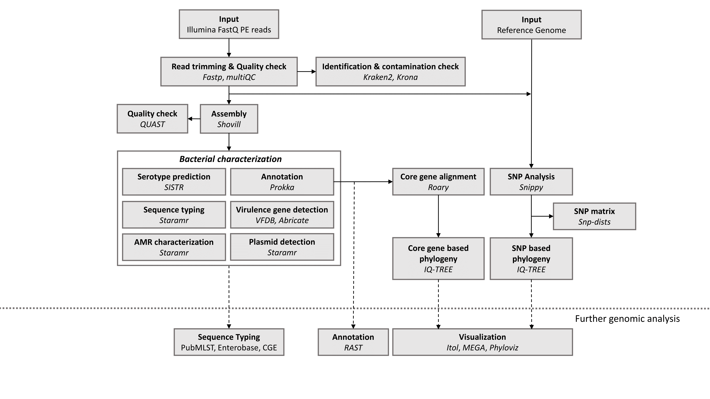
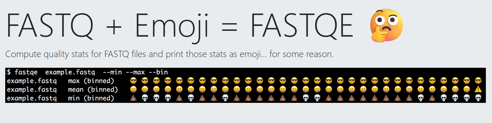

---
!!! info "Lesson overview"
    **Teaching:** 15 min  
    **Exercises:** 15 min  

    **Questions**
    - What is the output of Next Generation Sequencing ?

    **Objectives**
    - Explain how a FASTQ file encodes per-base quality scores.

## What is the output of Next Generation Sequencing ?

The primary output of Next Generation Sequencing is a **FASTQ file**, which contains both the DNA sequences (reads) and their associated quality scores. This format is the universal standard for storing raw sequencing data **across all NGS platforms**.

**WARNING**: even if it's the same format doesn't mean that the downstream analyses will be the same.
Long read and Short reads have specific bioinformatic tools due to their specificity (short vs long reads, paired vs single reads)

## Data Used 

In this training we will build an assembly of a bacterial genome, from data produced in this paper: 
Hikichi, M., M. Nagao, K. Murase, C. Aikawa, T. Nozawa et al., 2019 Complete Genome Sequences of Eight Methicillin-Resistant Staphylococcus aureus Strains Isolated from Patients in Japan (I. L. G. Newton, Ed.). Microbiology Resource Announcements 8: 10.1128/mra.01212-19

Methicillin-resistant Staphylococcus aureus (MRSA) is a major pathogen causing nosocomial infections, and the clinical manifestations of MRSA range from asymptomatic colonization of the nasal mucosa to soft tissue infection to fulminant invasive disease. Here, we will analyze one of the eight MRSA strains isolated from patients in Japan : **DRR187559**.

!!! question "Exercise ?: Library & read length"
    Read the [referenced paper](https://journals.asm.org/doi/10.1128/mra.01212-19) and answer the following:

    1. Which library preparation kit, sequencing reagent kit, and sequencing platform were used for these data? Provide the exact phrasing from the paper that supports your answer.
    2. Based on the reagent kit and platform, what is the maximum theoretical read length per read, and what is the read layout (single‑end or paired‑end)?

    ??? "Solution"
        1. Evidence from the paper: "An Illumina short-read library was prepared using a Nextera DNA library prep kit, and paired-end reads were generated using a MiSeq reagent kit (v3-600) on the MiSeq platform (Illumina)."
        2. The MiSeq v3-600 reagent kit corresponds to paired‑end 2x300 bp sequencing, so the maximum theoretical read length is 300 bp per read and the layout is paired‑end.

Here is the link to download the Reverse and Forward reads from Illumina Sequencing for the sample **DRR187559**:

https://zenodo.org/record/10669812/files/DRR187559_1.fastqsanger.bz2
https://zenodo.org/record/10669812/files/DRR187559_2.fastqsanger.bz2

The terminology **.fastqsanger** is used only to indicate Phred+33 coding, which is crucial for the subsequent steps (trimming, alignment, assembly).

### Key characteristics of NGS output:

- **Millions of reads**: A single sequencing run generates millions to billions of short DNA sequences
- **Paired-end files**: For paired-end sequencing, data comes in two files (R1/R2 or _1/_2), representing forward and reverse reads from the same DNA fragment
- **Large file sizes**: FASTQ files are typically compressed (.gz, .bz2) due to their size
- **Quality information**: Each base includes a confidence score

## Details on the FASTQ format

Although it looks complicated (and it is), we can understand the [FASTQ](https://en.wikipedia.org/wiki/FASTQ_format) format with a little decoding. Some rules about the format include the following:  

|Line|Description|   
|----|-----------|     
|1|Always begins with '@' followed by the information about the read|  
|2|The actual DNA sequence|  
|3|Always begins with a '+' and sometimes contains the same info as in line 1|  
|4|Has a string of characters which represent the quality scores; must have same number of characters as line 2|  

We can view the first complete read in one of the files from our dataset using `head` to look at
the first four lines. But we have to decompress one of the files first.

~~~
@MISEQ-LAB244-W7:156:000000000-A80CV:1:1101:12622:2006 1:N:0:CTCAGA
CCCGTTCCTCGGGCGTGCAGTCGGGCTTGCGGTCTGCCATGTCGTGTTCGGCGTCGGTGGTGCCGATCAGGGTGAAATCCGTCTCGTAGGGGATCGCGAAGATGATCCGCCCGTCCGTGCCCTGAAAGAAATAGCACTTGTCAGATCGGAAGAGCACACGTCTGAACTCCAGTCACCTCAGAATCTCGTATGCCGTCTTCTGCTTGAAAAAAAAAAAAGCAAACCTCTCACTCCCTCTACTCTACTCCCTT                                        
+                                                                                                
A>>1AFC>DD111A0E0001BGEC0AEGCCGEGGFHGHHGHGHHGGHHHGGGGGGGGGGGGGHHGEGGGHHHHGHHGHHHGGHHHHGGGGGGGGGGGGGGGGHHHHHHHGGGGGGGGHGGHHHHHHHHGFHHFFGHHHHHGGGGGGGGGGGGGGGGGGGGGGGGGGGGFFFFFFFFFFFFFFFFFFFFFBFFFF@F@FFFFFFFFFFBBFF?@;@#################################### 
~~~
{: .output}

### Line 1: @ header: 

The first line contains important metadata:
- Instrument name
- Run ID
- Flowcell coordinates
- Read number (1 or 2 for paired-end)
- Filter flag (Y/N)
- Index/barcode sequence

### Understanding Quality Scores (Phred scores):

Line 4 shows the quality of each nucleotide in the read. Quality is interpreted as the probability of an incorrect base call (e.g., 1 in 10) or, equivalently, the base call accuracy (e.g., 90%). Each nucleotide's numerical score's value is converted into a character code where every single character represents a quality score for an individual nucleotide. This conversion allows the alignment of each individual nucleotide with its quality score. For example, in the line above, the quality score line is: 

~~~
A>>1AFC>DD111A0E0001BGEC0AEGCCGEGGFHGHHGHGHHGGHHHGGGGGGGGGGGGGHHGEGGGHHHHGHHGHHHGGHHHHGGGGGGGGGGGGGGGGHHHHHHHGGGGGGGGHGGHHHHHHHHGFHHFFGHHHHHGGGGGGGGGGGGGGGGGGGGGGGGGGGGFFFFFFFFFFFFFFFFFFFFFBFFFF@F@FFFFFFFFFFBBFF?@;@#################################### 
~~~

Quality scores represent the probability that a base call is incorrect:

- **Q10**: 90% accuracy (1 in 10 chance of error)
- **Q20**: 99% accuracy (1 in 100 chance of error)  
- **Q30**: 99.9% accuracy (1 in 1,000 chance of error)
- **Q40**: 99.99% accuracy (1 in 10,000 chance of error)

The quality score Q relates to error probability P by: **Q = -10 × log₁₀(P)**

Most analyses require Q20 or Q30 minimum quality.

The numerical value assigned to each character depends on the 
sequencing platform that generated the reads. The sequencing machine used to generate our data 
uses the standard Sanger quality PHRED score encoding, using Illumina version 1.8 onwards.
Each character is assigned a quality score between 0 and 41, as shown in 
the chart below.

~~~
Quality encoding: !"#$%&'()*+,-./0123456789:;<=>?@ABCDEFGHIJ
                   |         |         |         |         |
Quality score:    01........11........21........31........41                                
~~~
{: .output}

Each quality score represents the probability that the corresponding nucleotide call is
incorrect. These probability values are the results of the base calling algorithm and depend on how 
much signal was captured for the base incorporation. This quality score is logarithmically based, so a quality score of 10 reflects a
base call accuracy of 90%, but a quality score of 20 reflects a base call accuracy of 99%. 
In this 
[link](https://drive5.com/usearch/manual/quality_score.html) you can find more information 
about quality scores.

Looking back at our read: 

~~~
@MISEQ-LAB244-W7:156:000000000-A80CV:1:1101:12622:2006 1:N:0:CTCAGA
CCCGTTCCTCGGGCGTGCAGTCGGGCTTGCGGTCTGCCATGTCGTGTTCGGCGTCGGTGGTGCCGATCAGGGTGAAATCCGTCTCGTAGGGGATCGCGAAGATGATCCGCCCGTCCGTGCCCTGAAAGAAATAGCACTTGTCAGATCGGAAGAGCACACGTCTGAACTCCAGTCACCTCAGAATCTCGTATGCCGTCTTCTGCTTGAAAAAAAAAAAAGCAAACCTCTCACTCCCTCTACTCTACTCCCTT                                        
+                                                                                                
A>>1AFC>DD111A0E0001BGEC0AEGCCGEGGFHGHHGHGHHGGHHHGGGGGGGGGGGGGHHGEGGGHHHHGHHGHHHGGHHHHGGGGGGGGGGGGGGGGHHHHHHHGGGGGGGGHGGHHHHHHHHGFHHFFGHHHHHGGGGGGGGGGGGGGGGGGGGGGGGGGGGFFFFFFFFFFFFFFFFFFFFFBFFFF@F@FFFFFFFFFFBBFF?@;@#################################### 
~~~
{: .output}

We can now see that there is a range of quality scores but that the end of the sequence is
very poor (`#` = a quality score of 2). 

!!! question "Extract the fastq file" 

    1. Click right on **DRR187559_1.fastq.bz2** and click extract.
    2. Click on the folder DRR187559_2.fastq. 
    3. Right click on DRR187559_2.fastq file, and click Open With: Notepad

    What is the name of the first read ? What is the length of the first read
    How many raw reads are in the file ? 451782

    ??? "Answer" 
        The name of the first read is @DRR187559.1. The length is this read is 85.

        There are **451782** raw reads in this file. 

## Bioinformatic workflows

When working with high-throughput sequencing data, the **fastq** reads you get off the sequencer must pass
through several different tools to generate your final desired output. The execution of this set of
tools in a specified order is commonly referred to as a **workflow** or a **pipeline**. 

An example of a ILLUMINA bacterial genome analysis workflow is provided below:

For this workshop, we will only do a subset of this workflow : 

1. Quality control - Assessing quality using FastQC and Trimming and/or filtering reads.
2. Assembly of bacterial genome and Quality Checking of the Assembly
3. Bacterial Characterization: Multi Locus Sequence Typing (MLST) and Anti-Microbial Resistance (AMR) Genome Annotation

These workflows in bioinformatics adopt a **plug-and-play approach** in that the output of one tool can be easily
used as input to another tool without any extensive configuration. Having standards for data formats is what 
makes this feasible. Standards ensure that data is stored in a way that is generally accepted and agreed upon 
within the community. Therefore, the tools used to analyze data at different workflow stages are built, assuming that the data will be provided in a specific format. 
Throughout the workshop we will encounter many data file formats. The first one is the *FASTQ Format*.         

## Assessing read quality using FASTqe
 
 This symbol can be hard to interpret, that's why we are going to use our first tool to have a better understanding of the data: *FastQE*.
 FastQE turns ASCII characters into emojis that are easy to interpret.

 We are going to use a Bioinformatic tool named **Galaxy**.

 

