!!! info "Lesson overview"
    **Questions**
    - How to get started in Galaxy ?

    **Objectives**
    - Learn how to upload a file
    - Learn how to use a tool
    - Learn how to view results
    - Learn how to view histories
    - Learn how to extract and run a workflow
    - Learn how to share a history

# Overview
* This is a short introduction to the Galaxy user interface - the web page that you interact with.
* We will cover key tasks in Galaxy: uploading files, using tools, viewing histories, and running workflows.

## Create an account on a Galaxy instance/server

If you already have an account, skip to the next section!

In Galaxy, *server* and *instance* are often used interchangeably. These terms basically mean that different regions have different Galaxy servers/instances, with slightly different tool installations and appearances. If you don't have a specific server/instance in mind, we recommend registering at one of the main public servers/instances, detailed below.

## What does Galaxy look like?

!!! example "Log in to Galaxy"
    1. Open your favorite browser (Chrome, Safari, Edge or Firefox, not Internet Explorer!)
    2. Browse to your Galaxy instance ([usegalaxy.org.au](https://usegalaxy.org.au/))
    3. Log in or register

    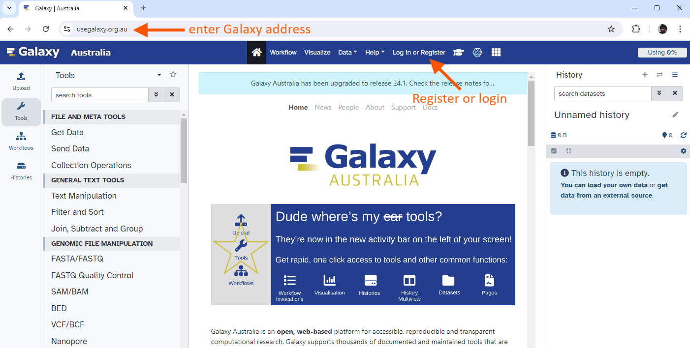

    !!! comment "Different Galaxy servers"
        This is an image of Galaxy Australia, located at [usegalaxy.org.au](https://usegalaxy.org.au/)

        You can also find more possible Galaxy servers depending on your region.

The Galaxy homepage is divided into four sections (panels):
* The Activity Bar on the left: _This is where you will navigate to the resources in Galaxy (Tools, Workflows, Histories etc.)_
* Currently active "Activity Panel" on the left: _By default, the  **Tools** activity will be active and its panel will be expanded_
* Viewing panel in the middle: _The main area for context for your analysis_
* History of analysis and files on the right: _Shows your "current" history; i.e.: Where any new files for your analysis will be stored_

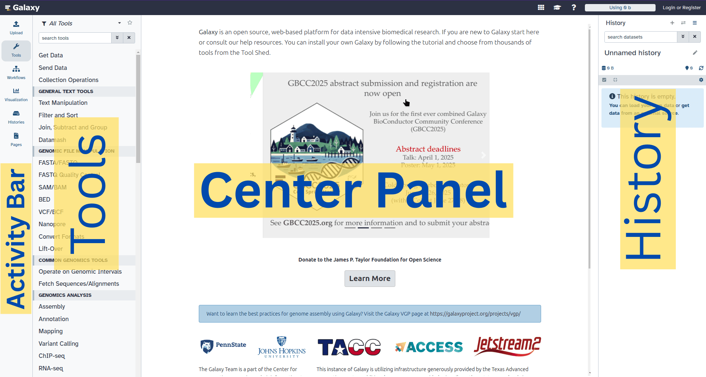

The first time you use Galaxy, there will be no files in your history panel.

# Key Galaxy actions

## Name your current history

Your "History" is in the panel at the right. It is a record of the actions you have taken.

!!! example "Name history"
    1. Go to the **History** panel (on the right)
    2. Click ✏️ (**Edit**) next to the history name (which by default is "Unnamed history")

        

    3. Type in a new name, for example, "Galaxy Tutorial"
    4. Click **Save**

    !!! comment "Renaming not an option?"
        If renaming does not work, it is possible you aren't logged in, so try logging in to Galaxy first. Anonymous users are only permitted to have one history, and they cannot rename it.

## Upload the data 

### Upload the files locally
With your reads, you will want to upload them locally (from your computer).

!!! example "Upload a file"
    1. At the top of the **Activity Bar**, click the  **Upload** activity

        

        This brings up a box:

    3. Click **Choose Local File** or Drop the files 
    5. Click **Start**
    6. Click **Close**

### Upload the files from SRA

In our case, it is different ! 
The raw reads we are interested in are available in the SRA.
the raw reads sample **KUN1163**  is available in the run [DRR187559]

There are tools that allows to upload directly sequences using the accession number !

1. Type **fastq sra** in the tools panel search box (top)
2. Click the tool (**Faster Download and Extract Reads in FASTQ**
format from NCBI SRA)

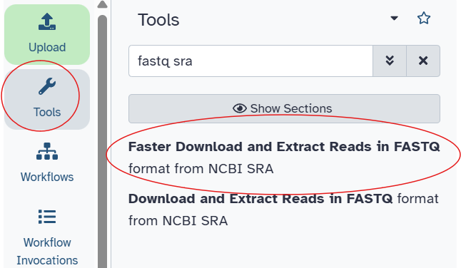

The tool will be displayed in the central Galaxy panel.

3. Select the following parameters:
    -  *select input type*: SRR accession
    - **Accession** : **DRR187559**
    - In **Advanced Options**, define format specification for sequence, type:
        '''
        @$ac.$sn/$ri length=$rl
        '''
    - No change in the other parameters
4. Click **Run Tool**

The parameter **@$ac.$sn/$ri length=$rl**  will produce headers like:
@DRR187559.1/1 length=164
@DRR187559.2/1 length=70
Where:
$ac = accession (DRR187559)
$sn = spot number (read number)
$ri = read index (1 for forward, 2 for reverse)
$rl = read length

This tool will run and 4 new output datasets will appear at the top of your history panel :
- Pair-end data (fasterq-dump)
- Single-end data (fasterq-dump)
- Other data (fasterq-dump)
- fasterq-dump log

## OUTPUT 
Your uploaded file is now in your current history.
When the file has uploaded to Galaxy, it will turn green.

After this you will see your first history item (called a "dataset") in Galaxy's right panel. It will go through
the gray (preparing/queued) and yellow (running) states to become green (success).

### LOG FILE 

First, we wil look at the **fasterq-dump log** file. 

!!! question "Excercise: View log contents"
    1. Click the 👁️ (eye) icon next to the file **fasterq-dump log**, to look at the file content.
    The contents of the file will be displayed in the central Galaxy panel. 
    - How many spots have been read ? 
    - How many reads have been read ? 
    - How can you explain the difference between the number of spots and reads ?
    - Look at the [metadata from the run](https://trace.ncbi.nlm.nih.gov/Traces/?view=run_browser&page_size=10&acc=DRR187559&display=metadata). Compare the number of spots to make sure we have retrieved all the data. 

    ??? "Answer"
    - spots read      : 451,782 
    - reads read      : 903,564 
    We have paired reads, so this run has two reads per spot, hence : **N reads = 2* N spots**. 
    - We have 451.8k spots in the metadata, same as in the log file, Good News !

### Reads retrieved from NCBI 

Our **Single-end data (fasterq-dump)** file and **Other data (fasterq-dump)** file should be empty, as there is only pair-end data in this run. 
You can delete them by click on the 🗑️ (bin) icon.
We will only use **Pair-end data (fasterq-dump)**.

!!! question "View forward reads"
    Next to the **Pair-end data (fasterq-dump)** in the history : 
    1. click the ✏️ (pencil) icon to rename the file to **DRR187559**. Click **Save**.
    2. Click on the file, inside you have a pair with 2 datasets, click on it. 
    3. Click the 👁️ (eye) icon next forward, to look at the file content.

The contents of the file will be displayed in the central Galaxy panel. If the dataset is large, you will see a warning message which explains that only the first megabyte is shown.

This file contains DNA sequencing reads from a bacteria, in FASTQ format:

, the sequence (`AATG…`), the plus character (`+`), and then the quality scores for the sequence (`5??A…`)."){:width="620px"}

!!! question "Extract the fastq file" 

    What is the name of the first read ? What is the length of the first read ?

    ??? "Answer" 
        The name of the first read is **@DRR187559.1/1**. The length is this read is **164**.

## Use a tool

Let's look at the quality of the reads in this file.

1. Type **FastQE** in the tools panel search box (top)
2. Click the tool (**FASTQE** visualize fastqfiles with emoji's)

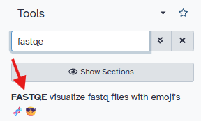

The tool will be displayed in the central Galaxy panel.

What is happening in **"Raw read data from your current history"** ?

We cannot use our dataset as there it is in the wrong format !
First, we need to Flatten the collection.  

1. Type **Flatten Collection** in the tools panel search box (top)
2. Click the tool (**Flatten Collection**)  
3. Read the description :
    "This tool takes nested collections such as a list of lists or a list of dataset pairs and produces a flat list from the inputs. It effectively "flattens" the hierarchy"
4. Select **DRR187559** *Input Collection*. 
5. Click *Run Tool*
6. Rename **data 13 and data 12 (flattened)** to **flattened DRR187559**. 

!!! question "Try FastQE again !" 
    1. Type **FastQE** in the tools panel search box (top)
    2. Click the tool (**FASTQE** visualize fastqfiles with emoji's)
    3. Select the following parameters:
    -  *FastQ data*: Select the format *Dataset Collection*, and selectt **flattened DRR187559** 
    - No change in the other parameters
    4. Click **Run Tool**

Let's look at the quality of the reads in this file.
This tool will run and two one new output datasets will appear at the top of your history panel.

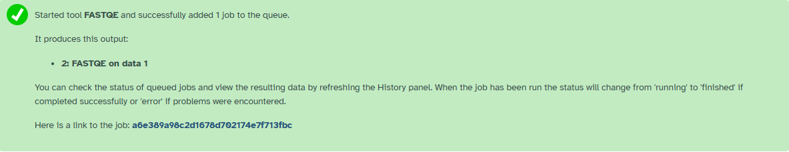{:width="620px"}

## View results

We will now look at the output dataset called *FastQE on data 1*.

!!! comment "Comment"
    * Note that Galaxy has given this dataset a name according to both the tool name ("FastQE") and the input ("data 1") that it used.
    * The name "data 1" means the dataset number 1 in Galaxy's current history (our FASTQ file).

!!! example "View results"
    * Once it's green, click the 👁️ (eye) icon next to the "Webpage" output dataset.

    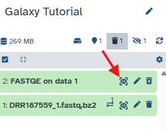
    
    The information is displayed in the central panel
    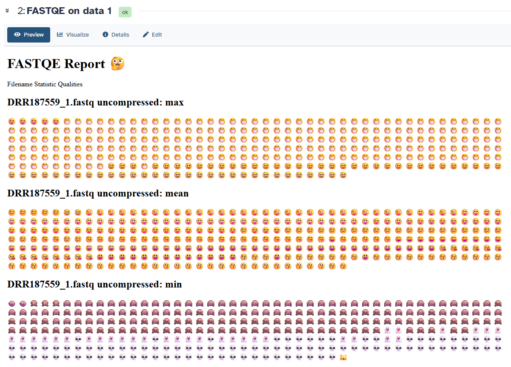

!!! exercice "Best and worst Quality"

    - What is the best and worst quality for the mean ? 
    - What is the best and worst quality for the min ? 
    - What is the best and worst quality for the max ? 

    Look on the [ fastqe website](https://github.com/fastqe/fastqe/) or at the scale displayed below : 

    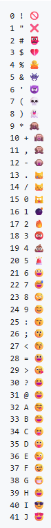
    
    ??? sucess "Answer"

        - For the max: the worst is 30 (😆) and the best is 38 (😁)    
        - For the min: the worst is 7(💀) and the best is 15 (🙀) 
        - For the mean: the worst is 24 (😊) and the best is 35(😛) 

## Share your history

!!! example "Share your history"
    Imagine you had a problem in your analysis and want to ask for help.

    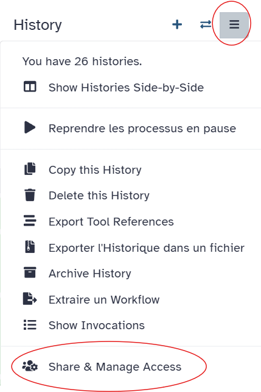

    In the main panel, click **Make History accessible**. 
    It creates an url, that you can share !

## Create a new history

Now, let's create a new history for our next analysis, which will be the Quality Checking.
We will name the new history according to the tool we will be using, here "FASTQC".

!!! example "New history"
    1. Create a new history
    2. Rename it, e.g., "FASTQC"

This new history has no datasets yet.

## Copy the previous dataset in the new history

We want to do the quality checking on the data from the sample DRR187559.
Because we already uploaded the forward reads form DRR187559 (DRR187559_1), we are going to copy the data from our first history "Galaxy Tutorial, to the history "FASTQC".

!!! example "View histories in History Multiview"
    1. Open **History Multiview** in the activity bar
    
    2. Or click **Show Histories side-by-side**
    3. Copy a dataset into your new history by dragging it from "Galaxy Tutorial" to "FASTQC"
    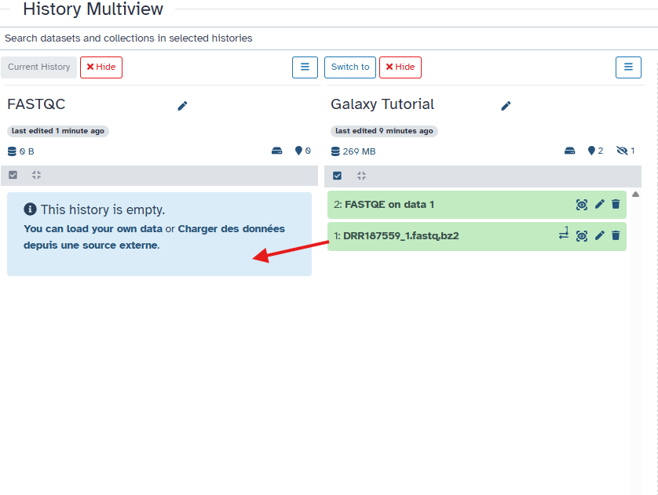
    4. Return to the main Galaxy window

!!! comment
    This is not the only way to view your histories in Galaxy:
    1. You can also click on **Datasets**, click on the needed file, and click **Copy to current history**

# Conclusion

Well done! You have completed the short introduction to Galaxy:

* Named a history
* Uploaded a file
* Used a tool
* Viewed results

## Bonus: Convert your analysis history into a workflow

Galaxy records every tool you run and the parameters used. You can convert this history into a workflow to reuse later.

!!! example "Extract workflow"
    1. Clean up your history: remove any failed (red) jobs
    2. Click (**History options**) → **Extract workflow**

    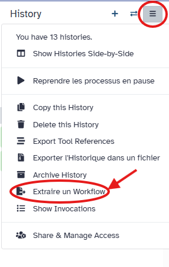

    3. Select the steps to include
    4. Replace the workflow name (e.g., `FASTQ Emoji Workflow`)
    5. Rename the workflow input (e.g., `FASTQ reads`)

    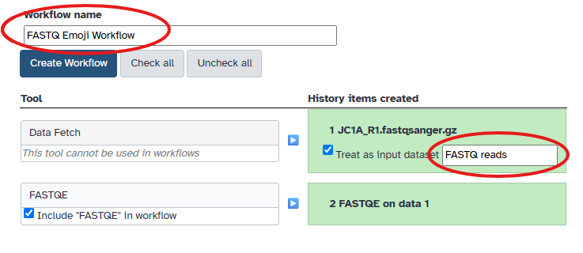

    6. Click **Create Workflow**

!!! Success "Key Points"
    - The Galaxy interface has an activity bar on the left, a tool (or other activated)
    panel next to it (if expanded), viewing pane in the middle, and a history of your
    data analysis on the right.
    - You can create a new history for each analysis. All your histories are saved.
    - 'To get data into Galaxy, you can upload a file by pasting in a web address. There
    are other ways to get data into Galaxy (not covered in this tutorial): you can upload
    a file from your computer, and you can import an entire history.'
    - Choose a tool and change any settings for your analysis.
    - Run the tool. The output files will be saved at the top of your history.
    - View the output files by clicking the eye icon.
    - View all your histories and move files between them. Switch to a different history.
    - Log out of your Galaxy server. When you log back in (to the same server), your histories
    will all be there.

