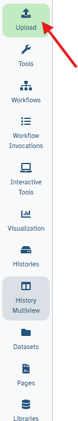
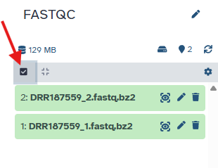
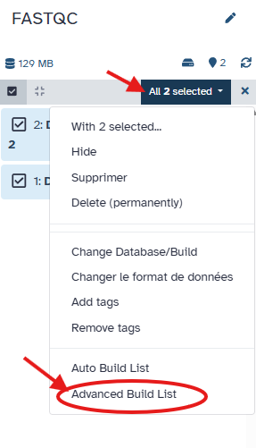
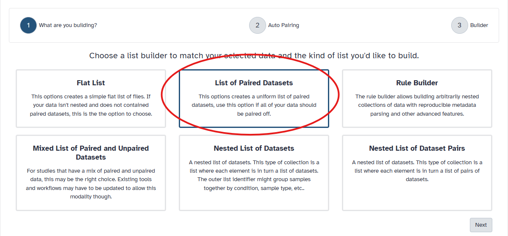
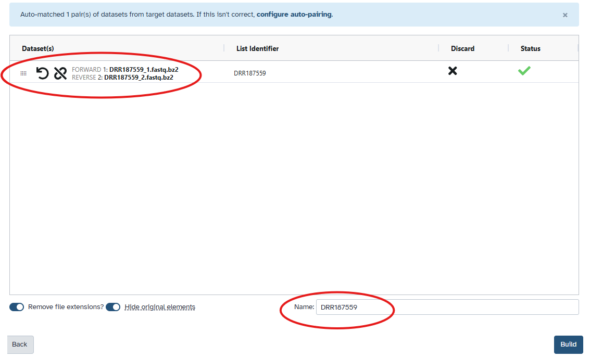
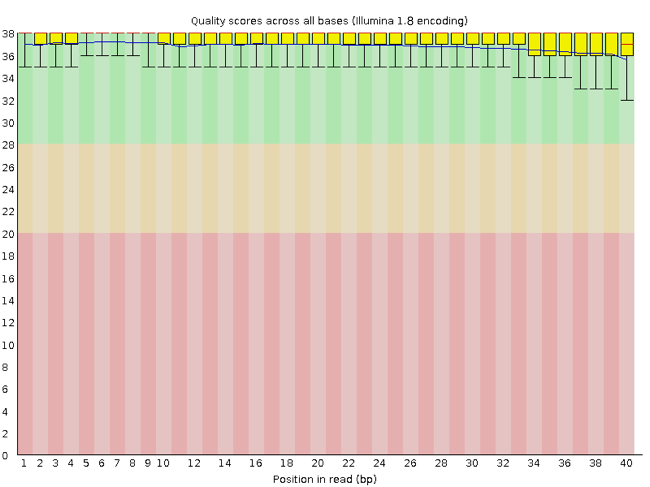
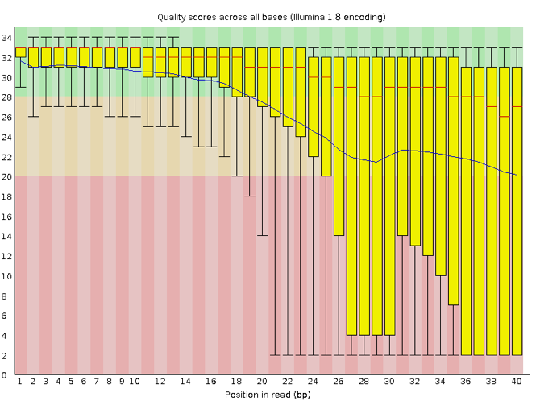
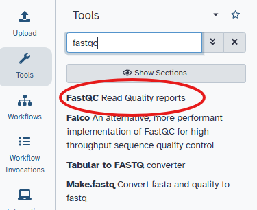
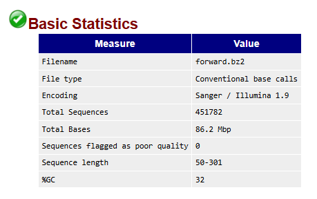
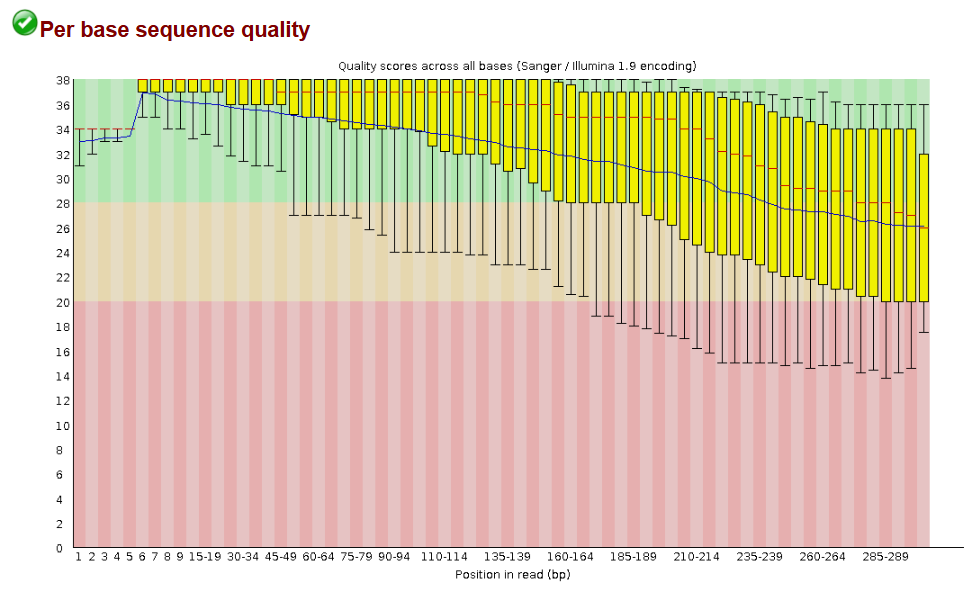

!!! info "Lesson overview"
    **Teaching:** 30 min  
    **Exercises:** 20 min  

    **Questions**
    - "How can I describe the quality of my data?"

    **Objectives**
    - Interpret a FastQC plot summarizing per-base quality across all reads.


# Running FastQC  

During sequencing, errors are introduced, such as incorrect nucleotides being called. These are due to the technical limitations of each sequencing platform. Sequencing errors might bias the analysis and can lead to a misinterpretation of the data. Adapters may also be present if the reads are longer than the fragments sequenced and trimming these may improve the number of reads mapped. Sequence quality control is therefore an essential first step in any analysis.

Before doing any assembly, the first questions we should ask about the input reads include:

What is the coverage of my genome?
How good are my reads?
Do I need to ask/perform for a new sequencing run?
Is it suitable for the analysis I need to do?


## Process paired-end data

With paired-end sequencing, the fragments are sequenced from both sides. This approach results in two reads per fragment, with the first read in forward orientation and the second read in reverse-complement orientation. With this technique, we have the advantage to get more information about each DNA fragment compared to reads sequenced by only single-end sequencing:

```
------>                       [single-end]

----------------------------- [fragment]

------>               <------ [paired-end]
```

The distance between both reads is known and therefore is additional information that can improve read mapping.

Paired-end sequencing generates 2 FASTQ files:

- One file with the sequences corresponding to **forward orientation of all the fragments**
- One file with the sequences corresponding to **reverse orientation of all the fragments**

Usually we recognize these two files which belong to one sample by the name which has the same identifier for the reads but a different extension, e.g. JC1A_R1.fastq for the forward reads and JC1A_R2.fastq for the reverse reads. It can also be _f or _1 for the forward reads and _r or _2 for the reverse reads.

## Upload the reads

We will now assess the quality of the reads that we downloaded.
In the previous tutorial, we have uploaded the forward reads from **DRR187559**, but we also need to upload the reverse reads from DRR187559.

!!! example "Upload a file from URL"
    1. At the top of the **Activity Bar**, click the  **Upload** activity

        

        This brings up a box:

    3. Click **Choose Local File** or Drop the files 
    4. Paste in the reverse read  file from the DRR187559 sample:

    ```
    DRR187559_2.fastqsanger.bz2
    ```

    5. Click **Start**
    6. Click **Close**

## Create a paired collection of data

Because we work with paired reads , we will create a paired collection of data to make it easier for the next analysis.
By group all of our data into one collection, we will have a distinct result for fastqc for the whole collection, instead of having many files in the history.

!!! Example "Creating a paired collection"

      1) Click on  **Select Items** at the top of the history panel

      

      2) Check all the datasets in your history you would like to include. In our case : 

        - DRR187559_1.fastqsanger.bz2
        - DRR187559_2.fastqsanger.bz2

      3) Click n of N selected and choose **Advanced Build List**

      

      4) You are in collection building wizard. Choose **List of Paired Datasets** and click ‘Next’ button at the right bottom corner:
      
      

      5) Check and configure auto-pairing. In our case, reads have suffix  _1 and _2. Click on ‘Next’ at the bottom.

      6) Check the result of the auto-pairing, and enter a name for the collection (**DRR187559**) 
      

      7) Your collection should now appear on the side !


## Assessing quality using FastQC

FastQC has several features that can give you a quick impression of any problems your
data may have, so you can consider these issues before moving forward with your
analyses. Rather than looking at quality scores for each read, FastQC looks at
quality collectively across all reads within a sample. The image below shows one FastQC-generated plot that indicates a very high-quality sample:



The x-axis displays the base position in the read, and the y-axis shows quality scores. In this 
example, the sample contains reads that are 40 bp long. This length is much shorter than the reads we 
are working on within our workflow. For each position, there is a box-and-whisker plot showing 
the distribution of quality scores for all reads at that position. The horizontal red line 
indicates the median quality score, and the yellow box shows the 1st to 
3rd quartile range. This range means that 50% of reads have a quality score that falls within the 
range of the yellow box at that position. The whiskers show the whole range covering 
the lowest (0th quartile) to highest (4th quartile) values.

The quality values for each position in this sample do not drop much lower than 32, which is a high-quality score. The plot background is also color-coded to identify good (green),
acceptable (yellow) and bad (red) quality scores.

Now let's look at a quality plot on the other end of the spectrum. 




The FastQC tool produces several other diagnostic plots to assess sample quality and the one plotted above. Here, we see positions within the read in which the boxes span a much more comprehensive range. Also, quality scores drop pretty low into the "bad" range, particularly on the tail end of the reads. 


## Run the  FASTQC tool

1. Type **FastQC** in the tools panel search box (top)
2. Click the tool (**FASTQC** Read Quality Reports).  

 

The tool will be displayed in the central Galaxy panel.

3. Select the following parameters:
    -  *"Raw read data from your current history"*: click on "dataset collection" ; the collection **DRR187559** should appear.
    - No change in the other parameters
4. Click **Run Tool**


## Viewing the FastQC results

In your history, Click on the galaxy file **FastQC on collection 1: Webpage**.
Now we can open the 2 HTML files for the sample **DRR187559**.
Click on **DRR187559**, then **forward**.

We first have a fastqc summary :

 


And then, the "Per Base Quality graph": 

 


!!! question "Exercise 5: Discuss the quality of sequencing files"

    Open the 2 HTML files. 
    For each, look at the "Per base sequence quality" graph.
    Discuss your results with a neighbor. 
    
    - What is a common trend among the 2 reads ?
 
    ??? "Solution"
        Common trend: The quality decreases toward the end of the reads. For Illumina data it is normal that the first few bases are of some lower quality and how longer the reads get the worse the quality becomes. This is often due to signal decay or phasing during the sequencing run.
    
## Decoding the other FastQC outputs
We've now looked at quite a few "Per base sequence quality" FastQC graphs, but there are nine other graphs that we haven't talked about! Below we have provided a brief overview of interpretations for each plot. For more information, please see the FastQC documentation [here](https://www.bioinformatics.babraham.ac.uk/projects/fastqc/Help/) 

+ [**Per tile sequence quality**](https://www.bioinformatics.babraham.ac.uk/projects/fastqc/Help/3%20Analysis%20Modules/12%20Per%20Tile%20Sequence%20Quality.html): the machines that perform sequencing are divided into tiles. This plot displays patterns in base quality along these tiles. Consistently low scores are often found around the edges, but hot spots could also occur in the middle if an air bubble was introduced during the run. 
+ [**Per sequence quality scores**](https://www.bioinformatics.babraham.ac.uk/projects/fastqc/Help/3%20Analysis%20Modules/3%20Per%20Sequence%20Quality%20Scores.html): a density plot of quality for all reads at all positions. This plot shows what quality scores are most common. 
+ [**Per base sequence content**](https://www.bioinformatics.babraham.ac.uk/projects/fastqc/Help/3%20Analysis%20Modules/4%20Per%20Base%20Sequence%20Content.html): plots the proportion of each base position over all of the reads. Typically, we expect to see each base roughly 25% of the time at each position, but this often fails at the beginning or end of the read due to quality or adapter content.
+ [**Per sequence GC content**](https://www.bioinformatics.babraham.ac.uk/projects/fastqc/Help/3%20Analysis%20Modules/5%20Per%20Sequence%20GC%20Content.html): a density plot of average GC content in each of the reads.  
+ [**Per base N content**](https://www.bioinformatics.babraham.ac.uk/projects/fastqc/Help/3%20Analysis%20Modules/6%20Per%20Base%20N%20Content.html): the percent of times that 'N' occurs at a position in all reads. If there is an increase at a particular position, this might indicate that something went wrong during sequencing.  
+ [**Sequence Length Distribution**](https://www.bioinformatics.babraham.ac.uk/projects/fastqc/Help/3%20Analysis%20Modules/7%20Sequence%20Length%20Distribution.html): the distribution of sequence lengths of all reads in the file. If the data is raw, there is often a sharp peak; however, if the reads have been trimmed, there may be a distribution of shorter lengths. 
+ [**Sequence Duplication Levels**](https://www.bioinformatics.babraham.ac.uk/projects/fastqc/Help/3%20Analysis%20Modules/8%20Duplicate%20Sequences.html): a distribution of duplicated sequences. In sequencing, we expect most reads to only occur once. If some sequences are occurring more than once, it might indicate enrichment bias (e.g. from PCR). This might not be true if the samples are high coverage (or RNA-seq or amplicon).  
+ [**Overrepresented sequences**](https://www.bioinformatics.babraham.ac.uk/projects/fastqc/Help/3%20Analysis%20Modules/9%20Overrepresented%20Sequences.html): a list of sequences that occur more frequently than would be expected by chance. 
+ [**Adapter Content**](https://www.bioinformatics.babraham.ac.uk/projects/fastqc/Help/3%20Analysis%20Modules/10%20Adapter%20Content.html): a graph indicating where adapter sequences occur in the reads.
+ [**K-mer Content**](https://www.bioinformatics.babraham.ac.uk/projects/fastqc/Help/3%20Analysis%20Modules/11%20Kmer%20Content.html): a graph showing any sequences which may show a positional bias within the reads.


## Quality of multiple samples, using MultiQC

Explore [MultiQC](https://multiqc.info/) if you want a tool that can show the quality of many samples at once.


!!! Success "Key Points"
    - "It is important to know the quality of our data to make decisions in the subsequent steps."
    - "FastQC is a program that allows us to know the quality of FASTQ files."