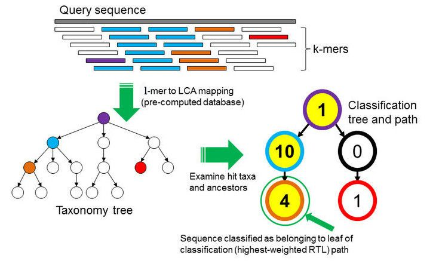

# Taxonomy Analysis

## SRA Taxonomy Analysis
ON the SRA sample webpage, the taxonomy analysis is automatically computed for every sample. 

!!! question "Exercice: Taxonomic composition of the sample"
    The taxonomy analysis is automatically computed for every sample submitted to the Sequence Read Archive. 
    ON the [SRA webpage from our sample](https://trace.ncbi.nlm.nih.gov/Traces/?view=run_browser&page_size=10&acc=DRR187559&display=analysis), look at the taxonomy analysis.
    Discuss with your neighbour about the composition. 

    ??? "Answer"

        The 59% "unassigned Staphylococcus" is normal, the large proportion of reads classified only to genus level (rather than species) likely reflects:

        - Conserved genomic regions shared across Staphylococcus species
        - Strain-specific sequences not well-represented in the reference database used for taxonomic classification
        - Database limitations rather than actual contamination

        Minor contaminants are acceptable: The trace amounts (<0.01%) of other bacteria (other Staphylococcus spp., Bacillales, Proteobacteria) are likely:
        - Skin/environmental flora from sample collection
        - Cross-contamination during plating/handling (inevitable at trace levels)
        - These tiny amounts won't affect genome assembly quality

        You should  if filter if Contamination is >5-10% of total reads. 

## How does it work ? 

To find out which microorganisms are present, we will compare the reads of the sample to a reference database, i.e. sequences of known microorganisms stored in a database, using [Kraken2](https://link.springer.com/article/10.1186/s13059-019-1891-0).

!!! question "Discussion: Taxonomic level of assignment"

    What do you think is harder to assign, a species (like _E. coli_) or a phylum (like Proteobacteria)?

    ??? "See a Discussion"
    
        Assigning a species is generally much harder than assigning a phylum. Here’s why:

        **Sequence similarity**

        At the phylum level, organisms are very different from each other. Even short reads often contain enough signal to confidently place them in a broad category like Proteobacteria.

        At the species level, differences can be very small. For example, E. coli shares a huge portion of its genome with Shigella or other Escherichia species. Short reads might not capture unique sequences, making it difficult to distinguish between closely related species.

        **Database coverage**

        All taxonomic mapping  tools rely on reference databases. Some species are underrepresented or missing, while higher-level taxa are well-covered. This makes phylum assignments more robust.

        **Genomic variability**

        Within a species, there can be large genomic diversity (e.g., different E. coli strains). This intra-species variation can confuse classifiers and lead to ambiguous assignments.

        **Conclusion**

        Phyla are defined by broader evolutionary signals, so natural variability within them doesn’t affect classification as much.
        In short: Assigning E. coli (species) is harder than assigning Proteobacteria (phylum) because species-level differences are subtler, databases may be incomplete, and intra-species variability can obscure signals.

# How does Kraken work: 

In the k-mer approach for taxonomy classification, we use a database containing DNA sequences of genomes whose taxonomy we already know. On a computer, the genome sequences are broken into short pieces of length k (called k-mers), usually 30bp.

Kraken examines the k-mers within the query sequence, searches for them in the database, looks for where these are placed within the taxonomy tree inside the database, makes the classification with the most probable position, then maps k-mers to the lowest common ancestor (LCA) of all genomes known to contain the given k-mer.

Kraken2 uses a compact hash table, a probabilistic data structure that allows for faster queries and lower memory requirements. It applies a spaced seed mask of s spaces to the minimizer and calculates a compact hash code, which is then used as a search query in its compact hash table; the lowest common ancestor (LCA) taxon associated with the compact hash code is then assigned to the k-mer.

You can find more information about the Kraken2 algorithm in the paper Improved metagenomic analysis with Kraken 2.

For this tutorial, we will use the PlusPF database which contains the Standard (archaea, bacteria, viral, plasmid, human, UniVec_Core), protozoa and fungi data.

## Kraken Reference dataset : Standard

A Kraken dataset is essentially a collection of reference sequences (genomes or proteins) that the software uses to classify sequencing reads.
The process to build it involves:

1. Collecting reference sequences – For example, complete bacterial, viral, or human genomes from RefSeq. Optionally, plasmids, fungi, plants, and vector sequences can be included.

2. Breaking sequences into k-mers – Each reference sequence is split into short, fixed-length DNA fragments called k-mers (commonly 35 bp).

In our study, we will use the Prebuild dataset Standard. 
For this tutorial, we will use the PlusPF database which contains the Standard (archaea, bacteria, viral, plasmid, human, UniVec_Core). The PlusPF Kraken2 database uses a k-mer size of **35**. 

| Database     | Origin                                                                 |
|-------------|------------------------------------------------------------------------|
| Archaea     | RefSeq complete archaeal genomes/proteins                               |
| Bacteria    | RefSeq complete bacterial genomes/proteins                              |
| Plasmid     | RefSeq plasmid nucleotide/protein sequences                             |
| Viral       | RefSeq complete viral genomes/proteins                                   |
| Human       | GRCh38 human genome/proteins                                            |
| Fungi       | RefSeq complete fungal genomes/proteins                                  |
| Plant       | RefSeq complete plant genomes/proteins                                   |
| Protozoa    | RefSeq complete protozoan genomes/proteins                               |
| UniVec_Core | A subset of UniVec, NCBI-supplied database of vector, adapter, linker, and primer sequences that may be contaminating sequencing projects and/or assemblies, chosen to minimize false positive hits to the vector database |

!!! question  "Exercice: Run Kraken2 on Galaxy"
    1: Search the tool **Kraken2**. 
    2. Select paired reads, and the collection **Trimmed DRR187559**.
    3. In *Minimum Base Quality*, select **20**. 
    3. In *Select a Kraken2 Database*, select **Prebuilt Refseq indexes: Standard-Full (archaea, bacteria, viral, plasmid, human,UniVec_Core) (Version: 2022-06-07 - Downloaded: 2022-07-06T094102Z)**. 
    4. In *Create Report*, click **Yes** for *Print a report with aggregrate counts/clade to file*.

The default confidence threshold of 0.0 will result in the most sensitive classification, while higher thresholds will increase precision at the cost of sensitivity, and we want to detect any contamination (even low-level).

## Kraken2 Output Overview

Kraken2 generates **two output files per dataset** (e.g., one per sample):
- Classification table
- Report: 

Classification

Each line corresponds to one sequence and has **5 columns**:

| Column | Meaning |
|--------|---------|
| **C/U** | `C` = classified, `U` = unclassified |
| **Sequence ID** | Identifier from the input file |
| **Taxonomy ID** | NCBI taxonomy ID assigned to the sequence (`0` if unclassified) |
| **Length** | Length of the sequence in bp (`read1|read2` for paired reads) |
| **LCA Mapping** | A space-delimited list indicating the lowest common ancestor (LCA) mapping of each k-mer in the sequence |

For example for the **LCA Mapping**, the result `562:13 561:4 A:31 0:1 562:3` would indicate that:

  1. The **first 13 k-mers** mapped to taxonomy ID **562**  
  2. The **next 4 k-mers** mapped to taxonomy ID **561**  
  3. The **next 31 k-mers** contained **ambiguous nucleotides** (`A`)  
  4. The **next k-mer** was **not found** in the database (`0`)  
  5. The **last 3 k-mers** mapped to taxonomy ID **562**  

## Visualization of taxonomic assignment

Once we have assigned the corresponding taxa to each sequence, the next step is to properly visualize the data. There are several tools for that. In our case, we will use **Krona**. 

Krakentools (Lu et al. 2017) is a suite of tools to work on Kraken outputs. It include a tool designed to translate results of the Kraken metagenomic classifier to the full representation of NCBI taxonomy. The output of this tool can be directly visualized by the Krona tool

!!! question  "Exercice: Convert Kraken report file"
    1. In the Tool, type : **Krakentools: Convert kraken report file to krona text file** 
    2. Kraken report file, select **Kraken2 on collection X: Report**
    3. Click, Run tools 

Let’s now run Krona !

!!! question "Generate Krona visualisation"
    1. In the Tool, type **Krona pie chart from taxonomic profile** 
    2. *Input file*: output of Krakentools
    3. Click *Run Tool*