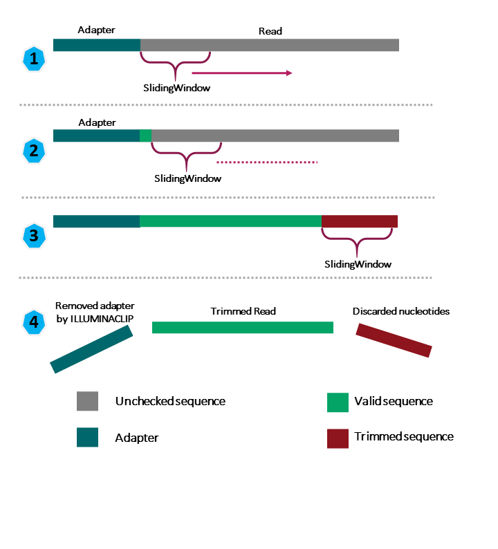
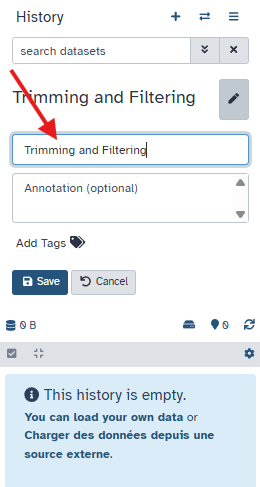

!!! info "Lesson overview"
    **Questions**
    - How can we get rid of sequence data that does not meet our quality standards?

    **Objectives**
    - Clean FASTQ reads using Trimmomatic.

## Why Should I clean reads ? 

In the last episode, we took a high-level look at the quality of each of our samples using `FastQC`. We visualized per-base quality graphs showing the distribution of the quality at each base across all the reads from our sample. This information helps us to determine 
the quality threshold we will accept, and thus, we saw information about which samples fail which quality checks. Some of our samples failed quite a few quality metrics used by FastQC. However, this does not mean that our samples should be thrown out! 
It is common to have some quality metrics fail, which may or may not be a problem for your downstream application. For our workflow, we  will remove some low-quality sequences to reduce our false-positive rate due to sequencing errors.

Illumina sequencing data can contain:

| Problem | What it is | Why it’s bad |
|----------|-------------|--------------|
| **Adapters** | Short artificial sequences added during library preparation | Can look like real DNA and confuse aligners or assemblers |
| **Low-quality bases** | The ends of reads often have unreliable base calls (low Phred scores) | Introduces errors |
| **Very short reads** | After trimming, some reads are too short to be useful | Adds noise |

To accomplish this, we will use a program called [Trimmomatic](http://www.usadellab.org/cms/?page=trimmomatic). 
This useful tool filters poor quality reads and trims poor quality bases from the specified samples.
Think of it like a “car wash” for raw sequencing reads 🚿 — it removes everything dirty or low-quality that could confuse later steps.
It “cleans” the data before any downstream analysis (assembly, mapping, classification, etc.).

# Trimmomatic options

Trimmomatic has a variety of options to accomplish its task. 
We  will follow a classic stepwise cleaning process: 
1. Remove adapters 
2. Remove bad-quality bases at the ends 
3. Remove bad-quality sections in the middle 
4. Throw away reads that are now too short  

Understanding the steps you are using to clean your data is essential. We will use only a few options and trimming steps in our analysis. For more information about the Trimmomatic arguments and options, see [the Trimmomatic manual](http://www.usadellab.org/cms/uploads/supplementary/Trimmomatic/TrimmomaticManual_V0.32.pdf). 

## 1. Remove adapters

Before removing adapters, we need to know which one you used !
Choosing the correct adapter sequence to trim depends on how your Illumina library was prepared. Knowing the sequencing platform determines expected adapter kit. In our case, by looking at the [referenced paper](https://journals.asm.org/doi/10.1128/mra.01212-19), we know that the kit used **Nextera DNA library prep kit**. TruSeq is the most common, it is the standard Illumina DNA/RNA libraries, Hence, we will choose **Nextera (paired end)**.

## 2. Remove bad-quality bases at the ends

As you saw in the fastQC HTML files, often the first and last bases are lower quality. Removing them improves overall read reliability.
We will use : 
LEADING:**quality** → Remove low quality bases from the beginning. As long as a base has a value below this 
threshold **quality** the base is removed and the next base will be investigated 

TRAILING:**quality** → Remove low quality bases from the end. As long as a base has a value below this threshold
**quality** the base is removed and the next base (which as trimmomatic is starting from the 3‟ prime end
would be base preceding the just removed base) will be investigated.

We will use a **threshold of 20**, so **LEADING:20** and **TRAILING:20**.

## 3. Remove bad-quality sections in the middle

To Remove bad-quality sections in the middle, we will use a Sliding window.  
We will use the default parameter, **SLIDINGWINDOW:4:20**. 

What does **SLIDINGWINDOW:4:20** mean ?

4 is for the size of the window, and 20 is for the minimum average quality. 
Trimmomatic slides a window of 4 bases along each read, from left to right ( from 5' to 3'). It calculates the average quality score of those 4 bases.
 If that average quality drops below 20, Trimmomatic cuts off (trims) the read from that position onward — meaning it removes everything to the right, not just that small window.   

Example: 
If the window at positions 32–36 drops below a quality of 20:

- Trimmomatic does not remove only those 4 bases.  
- It removes everything from base 32 to the end of the read.  
- The read becomes shorter — no blank space is left in the middle.  

## 4. Throw away reads that are now too short 

Finally, we will drop the reads shorter than a certain length.  
We will use a **minimum read length of 100bp**, considering that shorter reads may result in fragmented assemblies.  
Hence, we will use the parameters **MINLEN:100**.  
 
# Running Trimmomatic on Galaxy

Now that we understood the steps we are using to
clean the reads, we will run Trimmomatic on our data.
Instead of using a command, we are going to use Galaxy again !

Based on the process we discussed earlier, we are going to use this steps :

| step   | meaning |  
| ------- | ---------- |  
| `ILLUMINACLIP` | Perform adapter removal. |  
| `SLIDINGWINDOW` | Perform sliding window trimming, cutting once the average quality within the window falls below a threshold. |  
| `LEADING`  | Cut bases off the start of a read if below a threshold quality.  |  
|  `TRAILING` |  Cut bases off the end of a read if below a threshold quality. |  
| `MINLEN`  |  Drop an entire read if it is below a specified length. |  

We are going to run Trimmomatic on our collection **DRR187559**

### Create a new history 
First, let's create a new history, and name it "Trimming and Filtering"

Then using the History Multiview, we can move the collection from the previous analysis (FastQC) to the new history (Trimming and Filtering).

!!! question "Exercice: Run Trimmomatic"

    Type "Trimmomatic" inside the "Tools", and click on it.

    #### STEP 1: Choose the Adapter sequences to use

    When you prepare an Illumina library using the Nextera DNA library prep kit, the adapters used are *Nextera adapters*.
    First, click **Yes** for **Perform initial ILLUMINACLIP step?**.  
    In our case, for **Adapter sequences to use** we will choose **Nextera (paired end)** .  
    Keep the default parameters  for the adapters trimming (2:30:10).

    #### STEP 2: Remove bad-quality bases at the ends

    In **1: Trimmomatic Operation**, select the option   
    **Cut bases off the start of a read, if below a threshold quality (LEADING)**  
    Set the **Minimum quality required to keep a base**  at **20**.  

    Click on the button **Insert Trimmomatic Operation**.  
    It will add a window named **2: Trimmomatic Operation**.  
    This is the second step in our cleaning process.  
    Select **Cut bases off the end of a read, if below a threshold quality (TRAILING)**  
    Set the **Minimum quality required to keep a base**  at **20**.  

    #### STEP 3: Choose the trimming sliding window

    Click again on the button **Insert Trimmomatic Operation**.  
    It will add a window named **3: Trimmomatic Operation**.  
    Select **Sliding window trimming (SLIDINGWINDOW)**.  
    Keep the default parameters :

    - Number of bases to average across : 4
    - Average quality required : 20

    #### STEP 4: Choose the minimun length of READS

    MINLEN:100 is a good tradeoff: long enough for SPAdes, not too strict to keep most of the reads.

    Click again on the button **Insert Trimmomatic Operation**.  
    It will add a window named **4: Trimmomatic Operation**.  
    Select **Drop reads below a specified length (MINLEN)**.  
    Set  **Minimum length of reads to be kept** to **100**.  

    #### Keep the log 

    For the button **Output trimmomatic log messages?**, type **yes**.

    It is a useful step, as we are going to look at this log to see the results of the process.

    #### Run the tools 

    Once you have selected all the good parameters, you can click on "Run".

### Output

This command will take a few minutes to run, and you will see the ouput in your history.
It has created 3 files :

- Trimmomatic on collection X: paired 
- Trimmomatic on collection X: unpaired 
- Trimmomatic on collection X (log file)

# Results

## Log File
First, Open the file **Trimmomatic on collection X (log file)**

!!! question "Exercise  1: Should the output fastqfile file be smaller or bigger than the input file ?"
    ??? success "Answer"
        It should be smaller than our input file because we have removed reads.

!!! question "Exercise 2: What did Trimmomatic do?"

    Open the output **Trimmomatic on collection X (log file)** 

    1) What percent of reads did we discard from our sample?  
    2) What percent of reads did we keep both pairs?

    ??? Solution
        1) If we consider single reads aswell, only 5.43% were dropped. 
            
        2) 73.52 % of paired reads have been kept after trimming

!!! info "Quality Encoding"

    You may have noticed that Trimmomatic automatically detected the
    quality encoding of our sample (phred33). It is always a good idea to
    double-check this or manually enter the quality encoding.

  

## FASTQ FILE OUTPUTS

Now let's have a look at the 2 other outputs :

- Trimmomatic on collection X: paired   
- Trimmomatic on collection X: unpaired  

### What the two Trimmomatic outputs are
paired: Contains reads where both mates survived trimming.  
Usually a paired dataset/collection with two files per sample: forward_paired and reverse_paired.  
Use these for any downstream tool that expects paired‑end input (mappers, pair‑aware assemblers).  
Order is preserved so mate 1 and mate 2 still correspond.  

unpaired: Contains reads whose mate was discarded but the read itself passed trimming.  
Typically a single‑end dataset/collection (one file per sample) holding these leftover reads.  
These reads cannot be used as mates but can be used as single‑end input (e.g., single‑end mapping or as extra reads in assemblers). 

### Why reads go to each output
If both R1 and R2 pass filters → both go to paired. 
If one mate is discarded (too short/too low quality) but the other passes → the passing mate goes to unpaired and its partner (failed) is not kept. 
If both mates are discarded → neither appears in outputs.   

## Conclusion 
We have just successfully run Trimmomatic on our data collection ! 
From now on, we will only keep the paired collection  **Trimmomatic on collection X: paired**. 
Hence, we dropped 24% (100% - 73.52%) of the reads.  
Rename it **Trimmed DRR187559**. 

!!! question "Bonus Exercise: Quality test after trimming"

    Now that our samples have gone through quality control, they should perform
    better on the quality tests run by FastQC. 
    **Rerun the FastQC Analysis on the trimmed sequences** to check if our sequences have been succesfully filtered and trimmed.
    What is the new coverage after trimming ?

    ??? succes "Answer"
        After trimming and filtering, our overall quality is higher, 
        we have a distribution of sequence lengths, and more samples pass 
        adapter content. However, quality trimming is not perfect, and some
        programs are better at removing some sequences than others. Trimmomatic 
        did pretty well, though, and its performance is good enough for our workflow.

        Coverage: You look at the Total Bases in **Basic Statistics**, and you divide it by the expected genome size.
        Coverage = (Total bases R1 + Total bases R2) / Genome size
        Coverage = (58.3 + 68.2) / 2.8 ≈ **45× coverage**

This is **good coverage** for bacterial genome assembly

!!! Success "Key Points"
    - Use Trimmomatic to get rid of adapters and low-quality bases or reads.
    - Rerun the FastQC Analysis to check if our sequences have been succesfully filtered and trimmed.