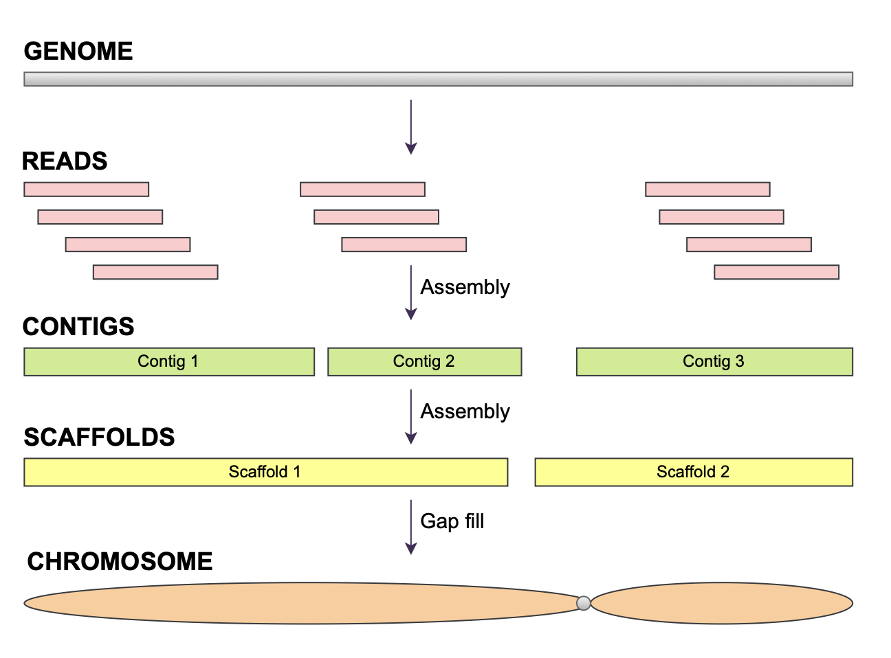
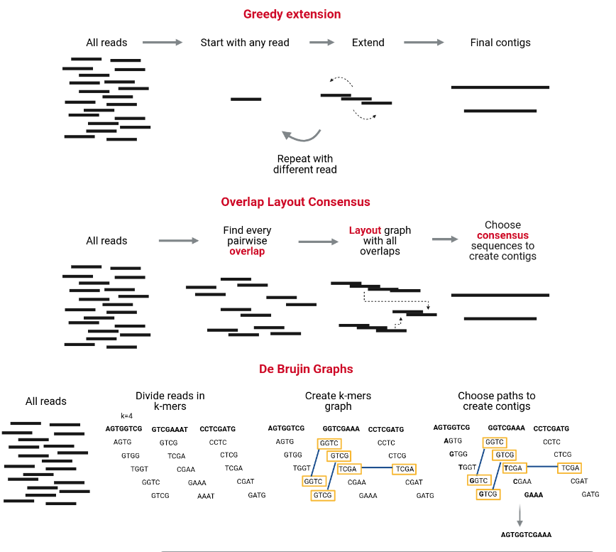

# Bacterial Genome Assembly
    **Questions**
    - Why do bacterial genomes need to be assembled?
    - What is the difference between reads, contigs, and scaffolds?
    - How do assemblers reconstruct a bacterial genome?
    - How do we assess the quality of an assembly?

    **Objectives**
    - Understand what a genome assembly is.  
    - Know the main assembly algorithms (Greedy, OLC, De Bruijn Graphs).  
    - Perform a bacterial genome assembly using **SPAdes**.  
    - Evaluate the assembly using **QUAST**.

---

# Introduction

Modern sequencing technologies generate **millions of short DNA fragments (reads)**, but not complete chromosomes.  
For bacterial genomics, our goal is to reconstruct the full genome of a bacterial isolate from these fragments.  
The process of stitching reads together into longer sequences is called **de novo assembly**.

Assembling a genome is conceptually similar to solving a jigsaw puzzle:

- The full genome is the picture we want to reconstruct.
- Reads are the small pieces of the puzzle.
- Overlaps and repeated patterns determine how the pieces fit together.

Unlike real puzzles, genome assembly is complicated by:

- **Sequencing errors**  
- **Repeated regions** that appear identical  
- **Uneven sequencing depth**  
- **Contaminations** in the sample  

Despite these challenges, bacterial genomes (~1–7 Mb) are typically easier to assemble than metagenomes because they come from **one organism** and generally have **uniform coverage**.

# The type of assembly

## Reference-Based Assembly (Mapping)

Reference-based assembly aligns sequencing reads to an existing reference genome. This approach:
- **Requires** a high-quality reference genome from the same or closely related species
- Is **faster and computationally lighter** than de novo assembly
- Works well for **variant detection**, SNP calling, and comparative genomics
- **Limitations**: Cannot detect novel sequences, large structural variations, or genomic regions absent from the reference

## De Novo Assembly

De novo assembly reconstructs the genome from scratch without using a reference. This approach:
- Builds consensus sequences by finding **overlaps between reads**
- Is **essential** when no reference genome exists or when studying novel organisms
- Can detect **structural variations, insertions, deletions**, and novel genetic elements
- **Limitations**: More computationally intensive, may produce fragmented assemblies (multiple contigs instead of complete chromosomes)

!!! question "Which Assembly to choose ?"
 Read the [referenced paper](https://journals.asm.org/doi/10.1128/mra.01212-19) and answer the following questions:
    1. What kind off assembly has been chosen in the paper ? 
    2. Discuss with your neighbor, about this choice. 

    ??? "Answer"
        While reference-based assembly is faster, de novo assembly was essential for this study because the authors wanted to:
            - Capture the complete and unique genomic content of each strain
            - Identify novel resistance mechanisms and virulence factors specific to Japanese MRSA
            - Create high-quality reference genomes for these clinical isolates
            - Understand genomic diversity without bias from an existing reference

# How Do DE NEVO Assemblers Work?

## Reads → Contigs → Scaffolds

During de novo assembly, the algorithm steps are typically:

1. **Reads** (raw sequencing fragments)  
2. **Contigs**: overlapping reads merged into longer continuous sequences  
3. **Scaffolds**: contigs ordered and oriented using paired-end information  (Mainly useuful for visualization)

The figure below shows the hierarchy:

There are several strategies to assemble genomes. Most modern short-read assemblers use **De Bruijn Graphs**, but it is useful to know all three families of algorithms.

  

### **1. Greedy Extension**
- Start from a read, extend it by finding the next read with the highest overlap.  
- Repeats often confuse this method.  
- Rarely used in modern genomics.

### **2. OLC (Overlap–Layout–Consensus)**
- Find overlaps between all pairs of reads.  
- Build a graph of overlaps.  
- Resolve paths to produce contigs.  
- Used for long-read assemblers.

### **3. De Bruijn Graphs (most common for Illumina reads)**  
Reads are broken into **k-mers** (short subsequences of length *k*).  
A graph is built from overlapping k-mers, and contigs are extracted as paths through the graph.

This method is extremely efficient for large numbers of short reads.

---

# SPAdes: A Popular Bacterial Genome Assembler

[SPAdes](https://github.com/ablab/spades) (St. Petersburg genome assembler) is one of the most recommended tools for bacterial genomes.

Why SPAdes?

- Designed specifically for single bacterial genomes  
- Handles uneven coverage (useful for plasmids or mixed samples)  
- Uses multi-*k* De Bruijn Graphs for improved assembly  
- Widely used, well tested, fast  

SPAdes takes **FASTQ** files as input and outputs:

- **contigs.fasta**
- **scaffolds.fasta**
- **assembly graph files**

---

# Running SPAdes on Galaxy

What parameters do I need to choose for SPAdes ? 
the most important is k-mers.

Always re-run FastQC on trimmed reads and check the read length distribution and median/mean length before finalizing k choices.
Choosing an appropriate k-mer range for SPAdes assembly requires balancing sensitivity and contiguity.
Smaller k values (e.g., 21–33–55) are more sensitive and help assemble low-coverage regions and short or repetitive sequences, whereas larger k values (e.g., 77–99–127) improve contiguity and repeat resolution but require longer, high-quality reads. Therefore, the k-mer range should always be chosen according to the read-length distribution and expected coverage after trimming

Below is an example workflow using Galaxy, similar to your metagenomics training.

## Create a new history

!!! example "Create a new history"
    1. Go to the **History** panel (right side).  
    2. Click **✏️ → Create new history**.  
    3. Click **Edit** next to the history name.  
    4. Rename it to **Bacterial Genome Assembly**.  
    5. Click **Save**.

---

## Import the trimmed reads

Use the **History Multiview** panel.

!!! example "Import input reads"
    1. Open the **History Multiview** (left panel).  
    2. Drag your **trimmed paired-end reads** from the previous history (e.g., “Trimmomatic”).  
    3. Drop them into the **Bacterial Genome Assembly** history.

---

# Assembly with SPAdes

## Launch the SPAdes tool

1. In the Galaxy tools panel, search for **SPAdes**.  
2. Click **SPAdes genome assembler**.

## Tool parameters

### 1. Input Data
Choose:

- **Paired-end: list of dataset pairs**  
- Ensure the correct trimmed R1/R2 files are selected.

### 2. Options to select  

- in **Operation mode**, select : **Assembly and error correction**.
SPAdes performs BayesHammer/Hammer error correction on the raw reads before doing the assembly.
(fixes substitutions & small indels, removes low-quality kmers), which improve assembly quality but takes longer.

- in **Pipeline Options**:
      tick **Isolate**
      Enable careful mode reduce mismatches.

- **Select additional outputs**:  
  - Contigs  
  - Scaffolds  
  - Assembly graph with scaffolds
  - Log 

- **Select k-mer detection option**: Select "21, 33, 55, 77, 99, 127", commonly used for ILLUMINA for max length 300pb.

- Click **Run Tool**.

Assembly usually takes a few minutes depending on coverage and read depth.

## Galaxy Outputs 

SPAdes generates several output files with different assembly representations:

Main assembly files:

**SPAdes on data X and data X: Contigs**
Basic contigs without scaffolding
No gaps (N's)
Most conservative assembly

**SPAdes on data X and data X: Contigs**
Contigs linked together using paired-end information
Contains gaps represented as N's where SPAdes inferred connections
Longer sequences, but includes uncertainties

**SPAdes on data 2 and data 1: Assembly graph** and **SPAdes on data 2 and data 1: Assembly graph with scaffolds**
Used for visualization (Bandage) and understanding assembly structure
The difference between "Assembly graph" vs "Assembly graph with scaffolds":
Assembly graph: The basic de Bruijn graph structure
Assembly graph with scaffolds: Graph that includes scaffolding information (how contigs connect)

# Quality Control: QUAST

# Assembly Metrics using QUAST

Once your assembly is complete, it is essential to evaluate its quality before proceeding to downstream analyses. This is where **QUAST** (QUality ASsessment Tool) comes in.

**Why is assessing assembly quality important?**

- Assemblies can vary greatly in quality depending on input data and parameters.  
- Poor-quality assemblies may be fragmented, contain errors, or miss important regions, leading to inaccurate biological conclusions.  
- Quality metrics help you determine if your assembly is good enough or if you need to revisit earlier steps (e.g., trimming, coverage, assembly parameters).  

**QUAST provides a comprehensive set of metrics, including:**

- **Number of contigs:** Fewer contigs usually indicate a more contiguous assembly.  
- **N50 value:** The length at which half of the genome is contained in contigs of that size or longer; a higher N50 suggests better contiguity.  
- **Total assembly length:** Should approximate the expected genome size; large deviations can indicate contamination or missing data.  
- **GC content:** Helps detect contamination or unusual biases.  
- **Misassemblies and mismatches:** Identify errors or inconsistencies in the assembly.  

By reviewing these metrics, you can objectively assess your assembly’s completeness and accuracy, which is crucial for reliable downstream analyses.

!!! example "Run QUAST"
    1. Search for **QUAST** in the Galaxy Tools panel.  
    2. Select **contigs.fasta** from the SPAdes output. 
    In **Assembly Mode**: Select **Individual assembly (1 contig file per sample)**.
    In **Contigs/scaffolds file**, select **SPAdes on data X and data X: Scaffolds**
    In **Estimated reference genome size (in bp) for computing NGx statistics**, select : 2800000
    4. Run the tool.  

QUAST produces a summary table and plots showing the assembly quality.

## Example of Good Assembly Metrics (QUAST)

| Metric              | Good Assembly Characteristics                   | Why it matters                                   |
|---------------------|------------------------------------------------|-------------------------------------------------|
| **Number of contigs**| Low number (e.g., < 100 for bacterial genomes) | Indicates high contiguity and fewer gaps         |
| **N50**             | High value (e.g., > 50 kb for bacterial genomes)| Shows large contigs covering most of the genome  |
| **Total length**     | Close to expected genome size (e.g., ~4.5 Mb)  | Confirms completeness without excess contamination|
| **GC content**      | Matches known organism range (e.g., 35-60%)    | Suggests low contamination and accurate assembly  |
| **Misassemblies**    | Few or none                                     | Reflects assembly correctness and reliability    |
| **Mismatch rate**    | Low (few errors per 100 kb)                      | Ensures sequence accuracy                          |

**Note:** These values depend on the species and data quality. For bacteria, a near-complete genome with a few large contigs is ideal.

!!! Question "Assembly Metrics Evaluation"
    Open the file **Quast on data X: HTML report**
    - How many contigs is there?
    - What is the total length of all contigs?
    - What is you GC content?

    ??? "Answer"
        - 31 contigs, meaning the chromosome is separated over multiple contigs. These contigs can also contain (parts of) plasmids.
        - 2904652 (Total length (>= 0 bp)). Not far from the estimated genome size found in paper, which is 2.8 Mb.
        - The GC content for our assembly was 32.76%. For comparison, in the paper GC% is  around 32.89%.
        - Conclusion: The total length and the GC content of the assembly are coherent with expectations.

## QUAST Graphs

You can think of QUAST graphs as adding depth and context to the QUAST summary table.
The summary table gives you key numbers (N50, total length, number of contigs).

The graphs  revealing patterns you cannot see from the summary table alone:

-  the Cumulative Length   Genome coverage by largest contigs, with steeper curve = more complete assembly.

- "Nx plot" generated by QUAST (Gurevich et al. 2013) showing contigs ranked by size vs cumulative assembly completeness.
The Nx plot shows how quickly your largest contigs accumulate to cover the genome, helping you see how contiguous or fragmented your assembly is, cumulating informations of L50 and N50 (aswell as any Lx and Nx). 

- The GC content plot highlights unusual peaks that suggest contamination.

!!! Question "Assembly Graphs Evaluation"
    Navigate to the **Plots** section and examine the following:

    ### Part 1: Assembly Contiguity (Nx Plot)

    1. What are the **N50** and **L50** values for your assembly?
    2. Compare the number of contigs at different length thresholds:
      - Total contigs (≥0 bp): ____
      - Contigs ≥1000 bp: ____
      - Contigs ≥50000 bp: ____
    3. What do these metrics tell you about the quality and contiguity of your assembly?
    4. Examine the shape of the **Nx curve**:
      - Is it steep or gradual?
      - What does this indicate about contig size distribution?

    ### Part 2: Contamination Detection (GC Content)

    1. Look at the **GC content distribution** plot
    2. How many peaks do you observe in the distribution?
    3. What is the mean GC content percentage? ____
    4. Based on this plot, is there evidence of contamination in your assembly?

    ### Part 3: Overall Assembly Quality

    1. What is the **total assembly length**? ____
    2. What is the **largest contig** size? ____
    3. How many contigs contain 90% of the assembly (**L90**)? ____
    4. Compare scaffolds vs contigs results - what differences do you notice?

    ??? success "Answer and Interpretation" 
        ### Part 1: Assembly Contiguity
        
        **Key Metrics:**
        
        - **N50 = 184,225 bp (184.2 Kbp)**: The contig length at which 50% of the total assembly is contained in contigs of this size or larger
            - This is **excellent** for Illumina short-read assembly!
            - Well above the 100 Kbp threshold for high-quality bacterial assemblies
        
        - **L50 = 5 contigs**: Only 5 contigs are needed to cover 50% of the assembly
            - This is **excellent** (threshold: <10 is excellent)
            - Indicates highly contiguous assembly with few, large contigs
        
        - **L90 = 16 contigs**: 16 contigs contain 90% of the assembly
            - Very good - most of the genome is in a small number of contigs
        
        - **Largest contig = 419,723 bp (419.7 Kbp)**:
            - This single contig represents ~14% of the entire genome
            - Excellent for short-read assembly
        
        **Contig Distribution Analysis:**
        
        | Threshold | # Contigs | Interpretation |
        |-----------|-----------|----------------|
        | ≥0 bp (all) | 40 | Total includes very small contigs |
        | ≥1000 bp | 29 | 11 contigs are <1 Kbp (likely noise/artifacts) |
        | ≥5000 bp | 24 | Most contigs are substantial size |
        | ≥50000 bp | 16 | 16 large contigs form the core assembly |
        
        **What this means:**
        
        - **Only 11 tiny contigs** (<1 Kbp) out of 40 total = 27.5% are small
        - **16 contigs are ≥50 Kbp** = these contain most of the genome
        - The assembly is **not fragmented** - most information is in large pieces
        
        ---
        
        ### Part 2: Contamination Detection
        
        **GC Content Analysis:**
        
        - **Single, narrow peak** observed at **32.76% GC content**
        - **Mean GC%**: 32.76% (consistent across both scaffolds and contigs)
        
        **Interpretation:**
        
        ✅ **No contamination detected** because:
        
        - Only one peak in the distribution
        - Identical GC% in scaffolds (32.76%) and contigs (32.76%)
        - Narrow, symmetric distribution expected
        - All contigs cluster around similar GC content
        
        **Species context:**
        
        - 32.76% GC is relatively **AT-rich** 
        - Consistent with many pathogenic bacteria (e.g., Staphylococcus, Streptococcus, Clostridium)
        - If you know your species, verify this matches expected GC%
        
        **Interpretation:**
        
        ✅ **No contamination detected** because:
        
        - Only one peak in the distribution
        - Narrow, symmetric distribution
        - All contigs cluster around similar GC content
        
        ⚠️ **Signs of contamination would include:**
        
        - **Multiple peaks**: Indicating sequences from different organisms
        - **Bimodal distribution**: Two distinct GC content ranges
        - **Very broad distribution**: Highly variable GC content across contigs
        - **Outlier contigs**: Individual contigs with GC% far from the mean
        
        ---
        
        ### Part 3: Overall Assembly Assessment
        
        **Assembly Size:**
        
        - **Total length**: 2,904,652 bp (scaffolds) / 2,904,555 bp (contigs)
            - ~2.9 Mbp genome
            - Typical for many bacterial species
            - Difference of only 97 bp between scaffolds and contigs
        
        - **Largest contig**: 419,723 bp
            - Represents ~14.5% of the entire genome in one piece!
            - Excellent for short-read assembly
        
        **Scaffolds vs Contigs Comparison:**
        
        | Metric | Scaffolds | Contigs | Difference |
        |--------|-----------|---------|------------|
        | Total contigs | 31 | 32 | 1 more contig |
        | N50 | 184,225 | 184,225 | **Identical** |
        | L50 | 5 | 5 | **Identical** |
        | Total length | 2,904,652 | 2,904,555 | +97 bp |
        | GC% | 32.76% | 32.76% | Identical |
        | N's per 100 kbp | 3.34 | 0 | Scaffolds have gaps |
        
        **What this tells us:**
        
        - **Minimal scaffolding impact**: Scaffolding barely changed the assembly
        - **Only 97 N's total** in scaffolds (0.0033% of genome)
        - **Same N50/L50**: Scaffolding didn't merge any major contigs
        - **Conclusion**: Your contigs were already highly contiguous; scaffolding was unnecessary
        
        **Why so little scaffolding?**
        
        - Excellent initial assembly quality (high N50)
        - MiSeq v3-600 provides good 2×300 bp paired-end data
        - Proper Trimmomatic filtering preserved read quality and pairing
        - SPAdes already resolved most repeat regions
        
        ---
        
        ### Summary Assessment
        
        **🎯 Overall Quality: EXCELLENT**
        
        ✅ **Strengths:**
        
        - **Outstanding contiguity**: N50 = 184 Kbp, L50 = 5
        - **Large contigs**: Largest = 420 Kbp (14% of genome)
        - **Low fragmentation**: Only 29 contigs ≥1 Kbp
        - **No contamination**: Single GC peak at 32.76%
        - **Appropriate size**: 2.9 Mbp (typical bacterial genome)
        - **Minimal gaps**: Only 97 N's in entire assembly
        
        ⚠️ **Minor observations:**
        
        - 11 very small contigs (<1 Kbp) - likely assembly artifacts or plasmids
        - These can be filtered if needed (use MINLEN threshold in post-processing)
        
        **Next Steps:**
        
        1. ✅ **Proceed with annotation** - assembly quality is excellent
        2. Consider filtering contigs <1000 bp if they're not biologically relevant
        3. Compare to reference genome if available (QUAST with -r option)
        4. Identify the species if unknown (use BLAST or average nucleotide identity)
        
        **This assembly is publication-ready!**

!!! tip "Quality Benchmarks for Bacterial Genomes"
    
    | Metric | Good | Acceptable | Poor |
    |--------|------|------------|------|
    | **N50** | >100 Kbp | 50-100 Kbp | <50 Kbp |
    | **L50** | <10 | 10-50 | >50 |
    | **# Contigs** | <50 | 50-200 | >200 |
    | **GC peaks** | 1 | 1 | >1 |
    | **Total length** | Within 10% of expected | Within 20% | >20% difference |
    
    **Note**: These benchmarks assume short-read sequencing (Illumina). Long-read assemblies (PacBio/Nanopore) typically achieve much higher N50 values (>500 Kbp).

The size distribution plot shows if your assembly is dominated by a few large contigs or many small ones.

# Common Pitfalls in Bacterial Assembly

### 1. Low coverage
Below 20–30× makes assemblies fragmented.

### 2. Contamination
Foreign reads produce extra contigs. In this workshop we will not look at contamination, but 

### 3. Repeats and mobile elements
Plasmids and insertion sequences cause breaks in contigs.

### 4. Mixed strains
Can result in chimeric contigs.

### 5. Untrimmed adapters
Lead to errors in graph construction.

# Assembly Viewer using Bandage

While QUAST provides numerical summaries, it is also useful to **visually explore your assembly graph** to understand the assembly structure.

**Bandage** is a graphical tool designed to visualize assembly graphs generated by assemblers like SPAdes.

**Why visualize assembly graphs?**

- Assembly graphs reveal complex genome structures such as repeats, branches, and unresolved regions that are not obvious from summary statistics.  
- Visual inspection helps identify potential assembly issues such as:

  - **Fragmented assemblies** with many disconnected components.  
  - **Repeats and ambiguities** that cause branching in the graph.  
  - **Circular elements** like plasmids or phage genomes.  
- Understanding graph topology guides troubleshooting and can inform improvements in assembly strategy.  

Bandage allows you to:

- Load your assembly graph file (`.gfa`) and interactively explore contigs and connections.  
- Extract sequences from specific graph nodes or paths.  
- Annotate nodes to identify features or confirm circularity.

## What Does a Good Bandage Graph Look Like?

- **Mostly linear graph:** One or few long, continuous paths representing the chromosome(s).  
- **Few branches or bubbles:** Minimal complexity indicating low repeat content or successful repeat resolution.  
- **Circular structures (if expected):** Closed loops may represent plasmids or circular chromosomes.  
- **No excessive disconnected components:** Indicates little fragmentation or contamination.

## Bandage in Galaxy 

In **Tool**, select **Bandage Image, visualize de novo assembly graphs**.
In **Graphical Fragment Assembly**, select :
**SPAdes on data X and data X: Assembly graph with scaffolds**

!!! Question "How is the assembly ?"

    First read [this page in the Bandage wiki](https://github.com/rrwick/Bandage/wiki/Simple-example) to help understand what the graph means.
    Look at this Examples of Bandage:
    [Bandage  Vizualisation Example](../../fig/bact/06-assembly/bandage_viz_ex.png) 
    What do you think of the assembly of our sample, **DRR187559** ? Is it useful? Is it good enough?

    ???  "Answer"
        
        This is a very messy assembly, with a lot of potential paths through the sequence. We cannot feel confident in the output FASTA file (as it is much smaller than the expected 2.9Mbp). In real life we might consider doing a hybrid assembly with Nanopore or other long read data to help resolve these issues.

### Example interpretations:

| Graph Feature               | Meaning                                          |
|-----------------------------|-------------------------------------------------|
| Long linear contigs          | High-quality, contiguous assembly                |
| Small bubbles or forks       | Possible repeats or heterogeneity to resolve    |
| Multiple disconnected graphs | Possible contamination or unassembled fragments  |
| Circular loops              | Plasmids or circular DNA elements identified     |

Visualizing the assembly graph with Bandage helps confirm that your assembly structure matches biological expectations and guides troubleshooting if unusual features are seen.

## Conclusion
In this tutorial, we prepared short reads, assembled them, and inspect the produced assembly for its quality. The assembly, even if uncomplete, is reasonable good to be used in downstream analysis, like MLST or AMR.

## Which file do I use from now on ?
→ If your assembler produced contigs + scaffolds, **use contigs for all downstream analyses**.
No fake gaps (scaffolds include “N” runs that may not be biologically real), Lower risk of misassembly, More conservative and reliable

→ Use scaffolds only for visualization or when your analysis truly needs chromosome-level continuity.

# Summary

!!! success "Key Points"
    - Genome assembly reconstructs bacterial genomes from sequencing reads.  
    - Reads → Contigs → Scaffolds → Genome.  
    - De Bruijn Graphs (k-mers) are the foundation of short-read assembly.  
    - SPAdes is the standard tool for bacterial genome assembly.  
    - Assemblers take FASTQ reads as input and output contigs/scaffolds in FASTA format.  
    - Assembly quality should be evaluated using QUAST.

## BONUS: EXTRA STEPS FOR ASSEMBLY QUALITY ASSESSMENT

## BUSCO: Assessing Genome Completeness

**BUSCO** (Benchmarking Universal Single-Copy Orthologs) evaluates how complete a genome assembly is by checking for the presence of genes that should exist as single copies in nearly all members of a given lineage (e.g., bacteria).

### What BUSCO Reports
- **Complete (C):** Genes found in full length  
- **Complete and single-copy (S):** Ideal—no duplication  
- **Complete and duplicated (D):** Gene appears more than once (may reflect plasmids, repeats, or misassembly)  
- **Fragmented (F):** Only partial gene found  
- **Missing (M):** Gene not detected  

### Why BUSCO is Important
- **Measures biological completeness:** Ensures your assembly contains the full functional gene content expected for the organism.  
- **Detects fragmentation:** High fragmented or missing percentages indicate low-quality assembly or low coverage.  
- **Helps compare assemblies:** BUSCO provides an objective metric across tools, datasets, or species.  

### What Is Considered a Good BUSCO Score?
For bacterial genomes:
- **>95% Complete** is excellent  
- **<5% Missing** is expected for high-quality assemblies  
- Duplications should be low unless plasmids or paralogs exist  

Despite BUSCO being robust for species that have been widely studied, it can be inaccurate when the newly assembled genome belongs to a taxonomic group that is not well represented in OrthoDB. Even in a well-represented taxonomic group, the bias on the selection of reference genomes selected to create OrthoDB can lead to an under-scoring of the newly assembled genome and is dependent on the evolution of the genomes. 

## Chromeister: Whole-Genome Alignment for Structural Validation

**Chromeister** is a fast, interactive genome alignment tool that compares your assembly to a reference genome using dot-plot visualization.

### What Chromeister Provides
- **Whole-genome alignment dot plots**  
- **Detection of large-scale structural features**, such as:
  - Inversions  
  - Rearrangements  
  - Duplications  
  - Contamination  
- **Assessment of assembly order and orientation**  

### Why Chromeister Is Important
- **Validates correctness:** Ensures your contigs align in the correct order relative to a reference genome.  
- **Detects structural errors:** Misassemblies produce breaks, diagonal flips, or chaotic dot plots.  
- **Identifies contamination:** Off-diagonal or scattered alignments can reveal foreign sequences.  
- **Useful even for draft assemblies:** Helps determine whether scaffolding or polishing is needed.

